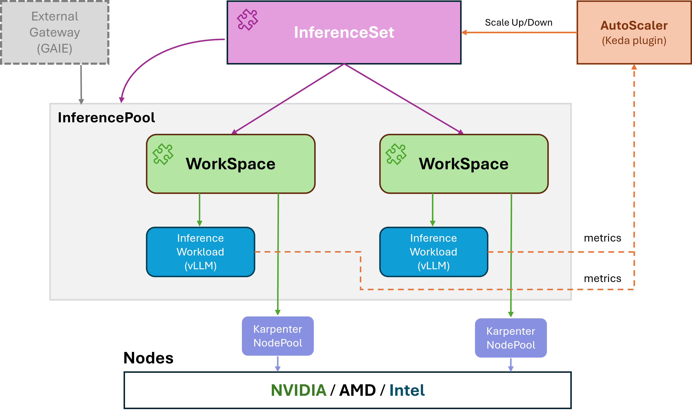

# Kubernetes AI Toolchain Operator (KAITO)


[](https://goreportcard.com/report/github.com/kaito-project/kaito)

[](https://codecov.io/gh/kaito-project/kaito)
[](https://app.fossa.com/projects/git%2Bgithub.com%2Fkaito-project%2Fkaito?ref=badge_shield)

|  What is NEW!                                                                                                                                                                                                |
| ---------------------------------------------------------------------------------------------------------------------------------------------------------------------------------------------------------------------------------------------- |
| Retrieval Augmented Generation (RAG) support is live! - KAITO RagEngine uses LlamaIndex and FAISS, learn about it [here](https://kaito-project.github.io/kaito/docs/rag)! |
| Latest Release: Aug 7th, 2025. KAITO v0.6.0                                                                                                                                                                                                  |
| First Release: Nov 15th, 2023. KAITO v0.1.0.                                                                                                                                                                                                   |

KAITO is an operator that automates the AI/ML model inference or tuning workload in a Kubernetes cluster.
The target models are popular open-sourced large models such as [phi-4](https://huggingface.co/microsoft/phi-4) and [llama](https://huggingface.co/meta-llama).
KAITO has the following key differentiations compared to most of the mainstream model deployment methodologies built on top of virtual machine infrastructures:

- Manage large model files using container images. An OpenAI-compatible server is provided to perform inference calls.
- Provide preset configurations to avoid adjusting workload parameters based on GPU hardware.
- Provide support for popular open-sourced inference runtimes: [vLLM](https://github.com/vllm-project/vllm) and [transformers](https://github.com/huggingface/transformers).
- Auto-provision GPU nodes based on model requirements.
- Host large model images in the public Microsoft Container Registry (MCR) if the license allows.

Using KAITO, the workflow of onboarding large AI inference models in Kubernetes is largely simplified.

## Architecture

KAITO follows the classic Kubernetes Custom Resource Definition(CRD)/controller design pattern. User manages a `workspace` custom resource which describes the GPU requirements and the inference or tuning specification. KAITO controllers will automate the deployment by reconciling the `workspace` custom resource.
<div align="left">
  
</div>

The above figure presents the KAITO architecture overview. Its major components consist of:

- **Workspace controller**: It reconciles the `workspace` custom resource, creates `NodeClaim` (explained below) custom resources to trigger node auto provisioning, and creates the inference or tuning workload (`deployment`, `statefulset` or `job`) based on the model preset configurations.
- **Node provisioner controller**: The controller's name is *gpu-provisioner* in [gpu-provisioner helm chart](https://github.com/Azure/gpu-provisioner/tree/main/charts/gpu-provisioner). It uses the `NodeClaim` CRD originated from [Karpenter](https://sigs.k8s.io/karpenter) to interact with the workspace controller. It integrates with Azure Resource Manager REST APIs to add new GPU nodes to the AKS or AKS Arc cluster.
> Note: The [*gpu-provisioner*](https://github.com/Azure/gpu-provisioner) is an open sourced component. It can be replaced by other controllers if they support [Karpenter-core](https://sigs.k8s.io/karpenter) APIs.

**NEW!** Starting with version v0.5.0, KAITO releases a new operator, **RAGEngine**, which is used to streamline the process of managing a Retrieval Augmented Generation(RAG) service.
<div align="left">
  
</div>

As illustrated in the above figure, the **RAGEngine controller** reconciles the `ragengine` custom resource and creates a `RAGService` deployment. The `RAGService` provides the following capabilities:
  - **Orchestration**: use [LlamaIndex](https://github.com/run-llama/llama_index) orchestrator.
  - **Embedding**: support both local and remote embedding services, to embed queries and documents in the vector database.
  - **Vector database**: support a built-in [faiss](https://github.com/facebookresearch/faiss) in-memory vector database. Remote vector database support will be added soon.
  - **Backend inference**: support any OAI compatible inference service.

The details of the service APIs can be found in this [document](https://kaito-project.github.io/kaito/docs/rag).


## Installation

- **Workspace**: Please check the installation guidance [here](https://kaito-project.github.io/kaito/docs/installation) for deployment using helm and [here](./terraform/README.md) for deployment using Terraform.
- **RAGEngine**: Please check the installation guidance [here](https://kaito-project.github.io/kaito/docs/rag).

## Workspace quick start

After installing KAITO, one can try following commands to start a phi-3.5-mini-instruct inference service.

```sh
$ cat examples/inference/kaito_workspace_phi_3.5-instruct.yaml
apiVersion: kaito.sh/v1beta1
kind: Workspace
metadata:
  name: workspace-phi-3-5-mini
resource:
  instanceType: "Standard_NC24ads_A100_v4"
  labelSelector:
    matchLabels:
      apps: phi-3-5
inference:
  preset:
    name: phi-3.5-mini-instruct

$ kubectl apply -f examples/inference/kaito_workspace_phi_3.5-instruct.yaml
```

The workspace status can be tracked by running the following command. When the WORKSPACESUCCEEDED column becomes `True`, the model has been deployed successfully.

```sh
$ kubectl get workspace workspace-phi-3-5-mini
NAME                     INSTANCE                   RESOURCEREADY   INFERENCEREADY   JOBSTARTED   WORKSPACESUCCEEDED   AGE
workspace-phi-3-5-mini   Standard_NC24ads_A100_v4   True            True                          True                 4h15m
```

Next, one can find the inference service's cluster ip and use a temporal `curl` pod to test the service endpoint in the cluster.

```sh
# find service endpoint
$ kubectl get svc workspace-phi-3-5-mini
NAME                     TYPE        CLUSTER-IP   EXTERNAL-IP   PORT(S)            AGE
workspace-phi-3-5-mini   ClusterIP   <CLUSTERIP>  <none>        80/TCP,29500/TCP   10m
$ export CLUSTERIP=$(kubectl get svc workspace-phi-3-5-mini -o jsonpath="{.spec.clusterIPs[0]}")

# find available models
$ kubectl run -it --rm --restart=Never curl --image=curlimages/curl -- curl -s  http://$CLUSTERIP/v1/models | jq
{
  "object": "list",
  "data": [
    {
      "id": "phi-3.5-mini-instruct",
      "object": "model",
      "created": 1733370094,
      "owned_by": "vllm",
      "root": "/workspace/vllm/weights",
      "parent": null,
      "max_model_len": 16384
    }
  ]
}

# make an inference call using the model id (phi-3.5-mini-instruct) from previous step
$ kubectl run -it --rm --restart=Never curl --image=curlimages/curl -- curl -X POST http://$CLUSTERIP/v1/chat/completions \
  -H "Content-Type: application/json" \
  -d '{
    "model": "phi-3.5-mini-instruct",
    "messages": [{"role": "user", "content": "What is kubernetes?"}],
    "max_tokens": 50,
    "temperature": 0
  }'
```

## Usage

The detailed usage for KAITO supported models can be found in [**HERE**](https://kaito-project.github.io/kaito/docs/presets). In case users want to deploy their own containerized models, they can provide the pod template in the `inference` field of the workspace custom resource (please see [API definitions](./api/v1alpha1/workspace_types.go) for details).

> Note: Currently the controller does **NOT** handle automatic model upgrade. It only creates inference workloads based on the preset configurations if the workloads do not exist.

The number of the supported models in KAITO is growing! Please check [this](https://kaito-project.github.io/kaito/docs/preset-onboarding) document to see how to add a new supported model. Refer to [tuning document](https://kaito-project.github.io/kaito/docs/tuning), [inference document](https://kaito-project.github.io/kaito/docs/inference) , [RAGEngine document](https://kaito-project.github.io/kaito/docs/rag) and [FAQ](https://kaito-project.github.io/kaito/docs/faq) for more information.

## Contributing

[Read more](https://kaito-project.github.io/kaito/docs/contributing)
<!-- markdown-link-check-disable -->
This project welcomes contributions and suggestions. The contributions require you to agree to a
Contributor License Agreement (CLA) declaring that you have the right to, and actually do, grant us
the rights to use your contribution. For details, visit [CLAs for CNCF](https://github.com/cncf/cla?tab=readme-ov-file).

When you submit a pull request, a CLA bot will automatically determine whether you need to provide
a CLA and decorate the PR appropriately (e.g., status check, comment). Simply follow the instructions
provided by the bot. You will only need to do this once across all repos using our CLA.

This project has adopted the CLAs for CNCF, please electronically sign the CLA via
https://easycla.lfx.linuxfoundation.org. If you encounter issues, you can submit a ticket with the
Linux Foundation ID group through the [Linux Foundation Support website](https://jira.linuxfoundation.org/plugins/servlet/desk/portal/4/create/143).

## Get Involved!

- Join our [KAITO Community Slack](https://join.slack.com/t/kaito-z6a6575/shared_invite/zt-37gh89vw7-odHfqmPRc5oRnDG99SBJNA) to discuss features in development and proposals.
- We host a weekly community meeting for contributors on Tuesdays at 4:00pm PST. Please join here: [meeting link](https://zoom-lfx.platform.linuxfoundation.org/meeting/99948431028?password=05912bb9-53fb-4b22-a634-ab5f8261e94c).
- Reference the weekly meeting notes in our [KAITO community calls doc](https://docs.google.com/document/d/1OEC-WUQ2wn0TDQPsU09shMoXn5cW3dSrdu-M43Q79dA/edit?usp=sharing)!

## License

See [Apache License 2.0](LICENSE).


[](https://app.fossa.com/projects/git%2Bgithub.com%2Fkaito-project%2Fkaito?ref=badge_large)

## Code of Conduct

KAITO has adopted the [Cloud Native Compute Foundation Code of Conduct](https://github.com/cncf/foundation/blob/main/code-of-conduct.md). For more information see the [KAITO Code of Conduct](CODE_OF_CONDUCT.md).

<!-- markdown-link-check-enable -->
## Contact

- Please send emails to "KAITO devs" <kaito-dev@microsoft.com> for any issues.
