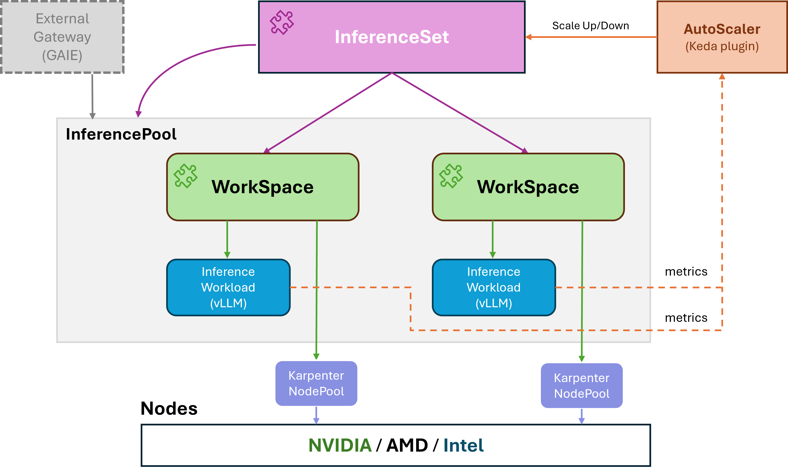
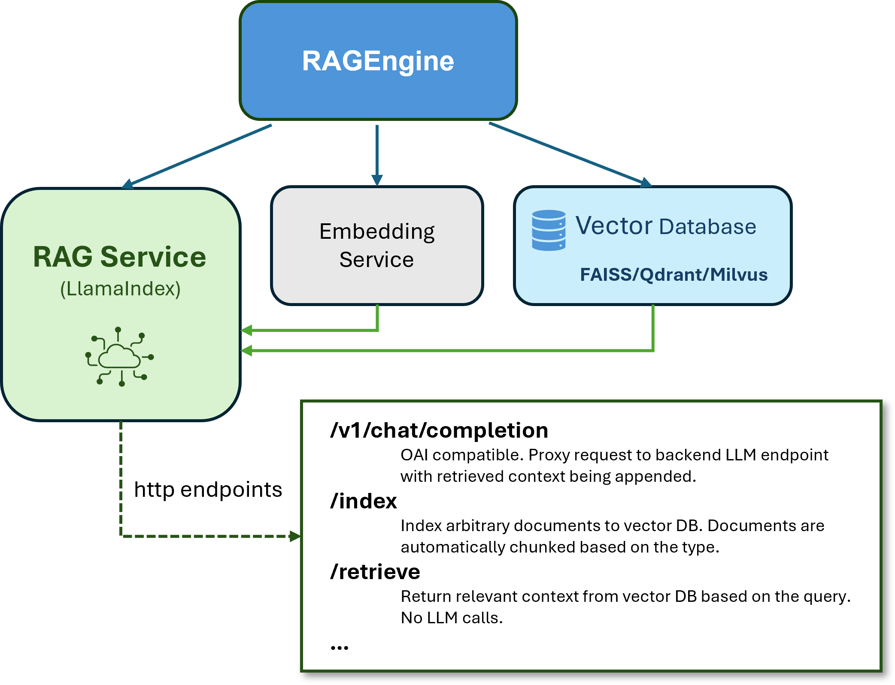

# Kubernetes AI Toolchain Operator (KAITO)

|  What is NEW!                                                                                                                                                                                                |
| ---------------------------------------------------------------------------------------------------------------------------------------------------------------------------------------------------------------------------------------------- |
| ALL vLLM supported modeled can be run in KAITO now, check the latest [release](https://github.com/kaito-project/kaito/releases). |
| Latest Release: Feb 26th, 2026. KAITO v0.9.0. |
| First Release: Nov 15th, 2023. KAITO v0.1.0. |

KAITO is an operator suite that automates LLM model inference, fine-tuning, and RAG (Retrieval Augmented Generation) engine deployment in a Kubernetes cluster.
KAITO has the following key differentiations compared to other inference model deployment methodologies:

- Simplify the CRD API by removing detailed deployment parameters. The controller provides optimized preset configurations for key inference engine scheduling parameters such as pipeline parallelism (PP), data parallelism (DP), tensor parallelism (TP), max model length, etc.
- Use node auto provisioner (NAP) to provision GPU resources with accurate model memory estimation, enabling the controller to pick the optimal node count for distributed inference.
- Leverage GPU node built-in local NVMe as model storage — no extra storage is required for inference.
- Support any [vLLM](https://github.com/vllm-project/vllm)-supported HuggingFace models.

## Architecture

KAITO follows the classic Kubernetes Custom Resource Definition(CRD)/controller design pattern for workload orchestration and integrates with [Gateway API Inference Extension](https://gateway-api-inference-extension.sigs.k8s.io/) to support LLM based routing.

  

- **Workspace**: The CRD that serves as the basic building block for managing LLM inference/tuning workloads. The API provides a largely simplified experience for deploying an LLM model in Kubernetes - the user provides the GPU instance type and the HuggingFace model ID, the controller will:
  - Estimate the GPU memory requirement based on the GPU instance type and model metadata, and calculate the required GPU count;
  - Trigger GPU node auto-provisioning by integrating with Karpenter APIs ([NodePool](https://karpenter.sh/docs/concepts/nodepools/));
  - Configure the inference engine parameters for single node/multiple nodes inference with optimized scheduling based on the GPU hardware topology.

  Currently, only the **vLLM** engine is supported. LoRA adapters are supported. KVCache offloading is enabled by default.
- **InferenceSet**: The CRD designed for managing the number of replicas of workspace instances for the same model. It is primarily used to autoscale the workspace based on inference request load. It reacts to scale-up/down actions determined by a KEDA autoscaler that uses vLLM metrics collected by a [KEDA plugin](https://github.com/kaito-project/keda-kaito-scaler).
- **InferencePool**: KAITO integrates [Gateway API Inference Extension](https://gateway-api-inference-extension.sigs.k8s.io/) by creating corresponding InferencePool object and EPP (Endpoint Picker, which enables KVCache-aware routing) per InferenceSet. It can work with any external gateway that supports the inference extension.

> Note: In this repo, an open-source [gpu-provisioner](https://github.com/Azure/gpu-provisioner) is used in the E2E test and is referred in various documents. KAITO can work with any other node provisioners that support the [Karpenter-core](https://sigs.k8s.io/karpenter) APIs.

KAITO also support a **RAGEngine** operator. It streamlines the process of managing a Retrieval Augmented Generation(RAG) service.

  

  - **RAGEngine**: The CRD that defines the components composed of a RAG service, including the LLM endpoint (optional), the embedding service and the vector DB. The controller will create all required components.
  - **Vector database**: support a built-in [FAISS](https://github.com/facebookresearch/faiss) in-memory vector database (default), and Qdrant/Milvus persistent databases if specified.
  - **Embedding**: support both local and remote embedding services, to embed documents in the vector database.
  - **RAGService**: The core service that leverages the [LlamaIndex](https://github.com/run-llama/llama_index) orchestration. It supports commonly used APIs such as `/index` for indexing documents, `/v1/chat/completion` for intercepting LLM calls to append retrieved context automatically, and `/retrieve` for integrating with MCP servers. The `/retrieve` API uses the Reciprocal Rank Fusion (RRF) hybrid search algorithm to combine the results from both BM25 sparse retrieval and vector dense retrieval.
  
The details of the service APIs can be found in this [document](https://kaito-project.github.io/kaito/docs/rag).

## Getting Started 
- **Installation**: Please check the guidance [here](https://kaito-project.github.io/kaito/docs/installation) for installing core components (Workspace, InferenceSet) using helm and [here](./terraform/README.md) for installation using Terraform.
- **Quick Start**: Please check the quick start guidance [here](https://kaito-project.github.io/kaito/docs/quick-start) for running your first model using KAITO!
- **AutoScaling**: Please check this [doc](https://kaito-project.github.io/kaito/docs/keda-autoscaler-inference) for configuring KAITO and KEDA to enable autoscaling inference workload.
- **BYO models using HuggingFace runtime**: If you plan to run any BYO models using the HuggingFace runtime, check this [doc](https://kaito-project.github.io/kaito/docs/custom-model). Note: KATIO only supports BYO models hosted in HuggingFace.
- **CPU models**: Please check this [doc](https://kaito-project.github.io/kaito/docs/aikit) for running CPU models using [aikit](https://github.com/kaito-project/aikit/).
- **RAGEngine**: Please check the installation guidance and usage documents [here](https://kaito-project.github.io/kaito/docs/rag).

## Contributing

[Read more](https://kaito-project.github.io/kaito/docs/contributing)
<!-- markdown-link-check-disable -->
This project welcomes contributions and suggestions. The contributions require you to agree to a
Contributor License Agreement (CLA) declaring that you have the right to, and actually do, grant us
the rights to use your contribution. For details, visit [CLAs for CNCF](https://github.com/cncf/cla?tab=readme-ov-file).

When you submit a pull request, a CLA bot will automatically determine whether you need to provide
a CLA and decorate the PR appropriately (e.g., status check, comment). Simply follow the instructions
provided by the bot. You will only need to do this once across all repos using our CLA.

This project has adopted the CLAs for CNCF, please electronically sign the CLA via
https://easycla.lfx.linuxfoundation.org. If you encounter issues, you can submit a ticket with the
Linux Foundation ID group through the [Linux Foundation Support website](https://jira.linuxfoundation.org/plugins/servlet/desk/portal/4/create/143).

## Get Involved!

- Visit [#KAITO channel in CNCF Slack](https://cloud-native.slack.com/archives/C09B4EWCZ5M) to discuss features in development and proposals.
- We host a weekly community meeting for contributors on Tuesdays at 4:00pm PST. Please join here: [meeting link](https://zoom-lfx.platform.linuxfoundation.org/meeting/99948431028?password=05912bb9-53fb-4b22-a634-ab5f8261e94c).
- Reference the weekly meeting notes in our [KAITO community calls doc](https://docs.google.com/document/d/1OEC-WUQ2wn0TDQPsU09shMoXn5cW3dSrdu-M43Q79dA/edit?usp=sharing)!

## License

See [Apache License 2.0](LICENSE).

## Code of Conduct

KAITO has adopted the [Cloud Native Compute Foundation Code of Conduct](https://github.com/cncf/foundation/blob/main/code-of-conduct.md). For more information see the [KAITO Code of Conduct](CODE_OF_CONDUCT.md).

<!-- markdown-link-check-enable -->
## Contact

- Please send emails to "KAITO devs" <kaito-dev@microsoft.com> for any issues.
