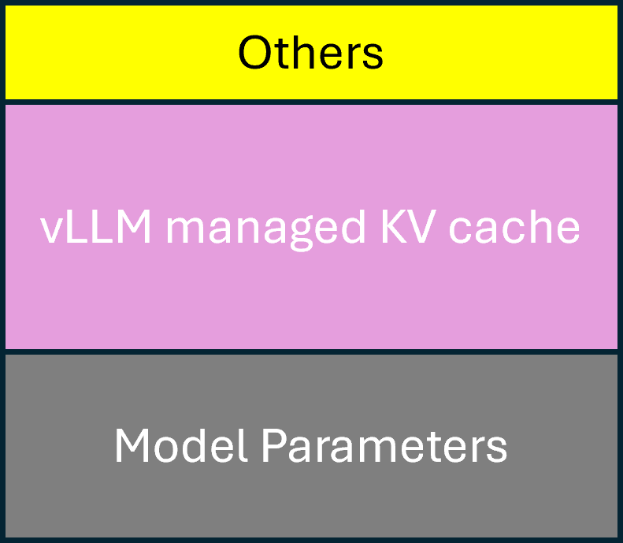

# OOM Prevention in Kaito

Large Language Model (LLM) inference typically requires significant GPU memory. Unlike traditional virtual memory management in operating systems, CUDA does not support GPU memory swapping. This limitation often leads to CUDA Out-Of-Memory (OOM) errors when GPU memory is insufficient for inference requests. Addressing GPU OOM issues is one of the most challenging aspects of LLM deployment and tuning.

This document explains the mechanisms Kaito implements to prevent CUDA OOM errors in inference workspaces. Since Kaito uses vLLM as its default inference engine, most of the discussion focuses on vLLM use cases.

## Background

The following diagram illustrates the GPU memory layout when serving inference requests using the vLLM engine:

  

The GPU memory is divided into three main components:

1. **Model Parameters**: These are the model weights (loaded from weight files, with or without quantization) that remain in GPU memory throughout the server's lifecycle.

2. **vLLM Managed KV Cache**: The vLLM cache manager attempts to allocate all remaining GPU memory for KV cache blocks to maximize memory utilization. To prevent the cache manager from allocating too much memory, vLLM provides a `gpu-memory-utilization` configuration parameter. This parameter specifies the fraction of GPU memory to be used for the model inference, ranging from 0 to 1. For example, a value of 0.9 reserves 10% of GPU memory for other operations.

3. **Other Memory**: A small portion of memory is reserved for ephemeral operations such as model activation.

The KV cache usage is dynamic and roughly proportional to the context length (the total length of input and output tokens). vLLM requires the KV cache to be sufficient for the full context when serving a request. To enforce this constraint, vLLM uses a `max-model-len` parameter, which defaults to the model's maximum context length (e.g., 128K for Phi-3 models) if not specified. During startup, vLLM performs an internal probing test using a fake request with the specified `max-model-len`. If the configured KV cache cannot handle this request, the vLLM engine fails to start. After startup, any inference request exceeding the `max-model-len` will fail.

## OOM Scenarios and Kaito's Solutions

Based on the above understanding, we identify and address the following potential OOM scenarios:

### Scenario 1: Insufficient GPU Memory for Model Parameters

Loading model parameters into GPU memory is a fundamental requirement for any LLM engine. Kaito records the required memory size for each supported model based on 16-bit floating-point precision, as documented in the model's HuggingFace documentation. The validation webhook checks if the specified GPU SKU has sufficient aggregated memory to meet these requirements. However, this check is skipped for SKUs not in Kaito's built-in SKU list.

> **Note**: Kaito allows users to modify the default vLLM configuration through a custom ConfigMap, which may include model quantization options. In such cases, the webhook's resource check might be overly restrictive because the actual memory footprint will be smaller if 4-bit or 8-bit quantization is enabled. Users can bypass this check by adding the annotation `kaito.sh/bypass-resource-checks: "true"` to the workspace custom resource when using quantized models on GPUs with limited memory.

### Scenario 2: Insufficient Memory for Other Operations

Setting a high `gpu-memory-utilization` value maximizes GPU memory utilization but can lead to OOM errors during operations like model activation if insufficient memory remains. Since different GPU SKUs have different GPU memory sizes, using a fixed percentage threshold for `gpu-memory-utilization` is suboptimal. Kaito dynamically adjusts the `gpu-memory-utilization` based on the GPU SKU's memory size, ensuring a smaller threshold for GPU SKUs with less than 20GB memory and a larger threshold (capped at 95%) for GPU SKUs with larger memory.

### Scenario 3: KV Cache Size Insufficient for `max-model-len`

This issue commonly occurs with models supporting large context windows (e.g., 128K). When users set a high `max-model-len` or use models with large default context windows, vLLM's internal probing test may fail on GPUs with limited memory. Typically, finding the optimal `max-model-len` to maximize KV cache utilization without causing OOM errors requires tedious manual searches.

To simplify this process, Kaito implements an external probing test using a binary search algorithm to find a near-optimal `max-model-len` based on available GPU memory. While this test slightly increases service startup time, it eliminates the need for manual tuning. Users can find the calculated `max-model-len` in the inference service pod logs.

> **Note**: The external probing test currently only supports SKUs with a single GPU instance. For SKUs with multiple GPU instances and small per-instance memory (e.g., `Standard_NC12s_v3` with two 16GB v100 instances), users must manually specify the `max-model-len` in the workspace's ConfigMap. The validation webhook enforces this requirement.

## Generic Memory Usage Reduction

Benchmark tests demonstrate that enabling `expandable_segments=true` in PYTORCH_CUDA_ALLOC_CONF helps reduce memory fragmentation and peak memory consumption, particularly for tuning jobs. Kaito enables this flag by default in workspace pods.
