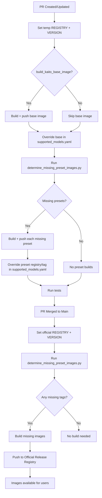

# KAITO Container Image Building Process

This document describes how KAITO handles container image building for AI models in different scenarios.

## Source of Truth: supported_models.yaml

The file [`presets/workspace/models/supported_models.yaml`](../presets/workspace/models/supported_models.yaml) is the single source of truth for KAITO presets. Each entry describes a preset combining:
- name: preset identifier (e.g., phi-3-mini-4k-instruct)
- runtime: inference runtime to use (e.g., tfs, vllm)
- version: source of model weights (e.g., HuggingFace URL/commit)
- tag: preset image tag to publish
- downloadAtRuntime: whether weights are fetched at runtime (no image build needed)

We use this file to detect changes that impact image builds:
- New preset introduction: a new entry appears in the list
- Tag bump: an existing preset’s `tag` value changes

These are collectively referred to as "affected" presets.

## Build Process

KAITO uses a multi-stage approach for building and distributing container images containing model weights and inference runtimes. The process differs between Pull Request validation and production releases to optimize resource usage and ensure quality.



## Pull Request (PR) Workflow

### Purpose
- Validate inference runtime and model weights integration for changed presets
- Test the preset image build process without affecting the official release registry

### Process
1. **Trigger**: When a PR is opened or updated with changes to model configurations
2. **Set PR-scoped variables**: Derive a temporary `REGISTRY` and `VERSION` from workflow context
3. **Target Registry**: Temporary/testing registry (separate from the official release registry)
4. **Optional base image build**: If `build_kaito_base_image == true`, build and push the base image, then override its `registry` and `tag` in `supported_models.yaml` for testing
5. **Build Strategy for presets**:
  - Run `determine_missing_preset_images.py` to list missing preset images for this PR context
  - For each listed preset, build and push to the temporary registry
  - Override each preset’s `registry` and `tag` in `supported_models.yaml` to point to the temporary values
6. **Consume overrides**: CI installs the chart/components using the PR `REGISTRY` and `VERSION` so tests exercise the freshly built images
7. **Cleanup**: Temporary images may be cleaned up after PR validation

## Official Release Workflow (Post-Merge)

### Purpose
- Build and publish official release images to the official container registry
- Ensure efficient resource utilization by avoiding redundant builds

### Process
1. **Trigger**: When changes are merged to the main branch
2. **Target Registry**: Official release registry (configurable via environment variables)
3. **Build Strategy**: **Smart Tag Checking**
  - Use `determine_missing_preset_images.py` to check existing tags in the registry
  - **Only build images when their tags are missing** from the registry
  - Skip models marked with `downloadAtRuntime: true`
  - Skip models where the exact tag already exists

### Tag Checking Logic
```python
# For each model in supported_models.yaml:
# 1. Check if model.downloadAtRuntime == true -> Skip
# 2. Query the official registry for existing tags: <REGISTRY_PREFIX>kaito-{model.name}
# 3. If model.tag exists in registry -> Skip build
# 4. If model.tag missing -> Add to build matrix
```
