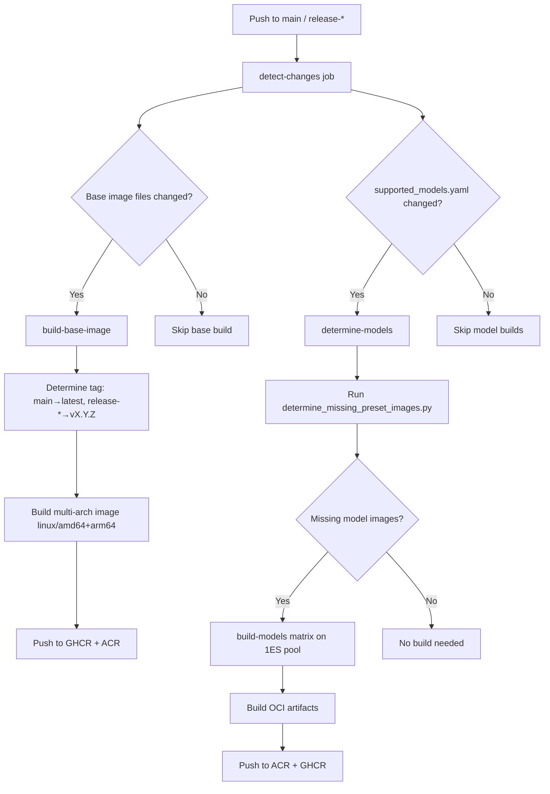
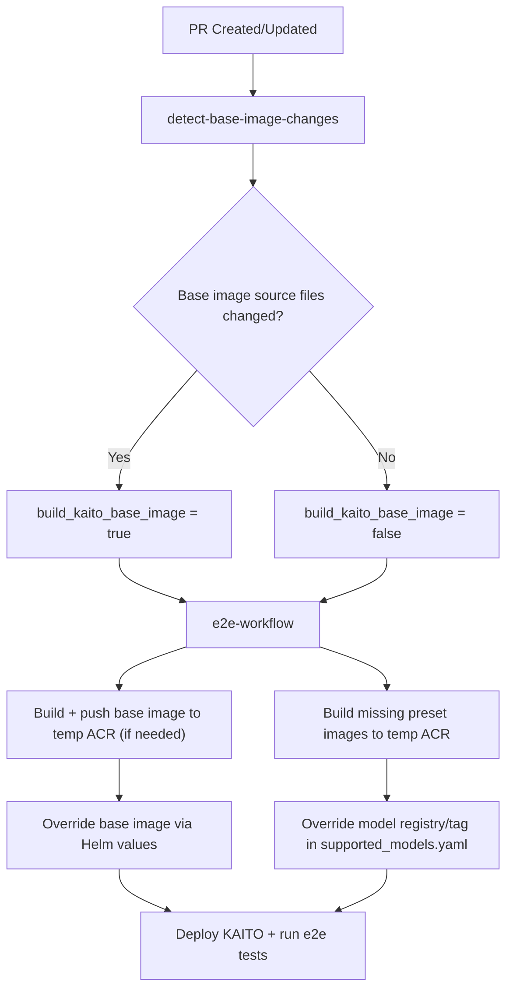

# KAITO Container Image Building Process

This document describes how KAITO handles container image building for AI models in different scenarios.

## Image Types

KAITO builds two types of preset images, managed independently:

### 1. Base Image (`kaito-base`)

The workspace base image contains the inference runtime (vLLM, transformers), tuning tools, and dependencies — but **no model weights**. It is built from `docker/presets/models/tfs/Dockerfile`.

The base image is **not** tracked in `supported_models.yaml`. Instead, its registry, name, and tag are passed to the workspace controller via environment variables set in the Helm chart:

| Environment Variable | Default | Description |
|---|---|---|
| `PRESET_BASE_REGISTRY_NAME` | `mcr.microsoft.com/aks/kaito` | Registry for the base image |
| `PRESET_BASE_IMAGE_NAME` | `kaito-base` | Image name |
| `PRESET_BASE_IMAGE_TAG` | `0.2.8` | Image tag |

Source files that affect the base image:
- `presets/workspace/inference/**`
- `presets/workspace/dependencies/**`
- `presets/workspace/tuning/**`
- `docker/presets/models/tfs/Dockerfile`

### 2. Model Preset Images

Each model preset packages model weights as an OCI artifact. These are tracked in [`presets/workspace/models/supported_models.yaml`](../presets/workspace/models/supported_models.yaml), which is the source of truth for model presets. Each entry describes:
- `name`: preset identifier (e.g., `phi-3-mini-4k-instruct`)
- `runtime`: inference runtime (e.g., `tfs`)
- `version`: source of model weights (e.g., HuggingFace URL/commit)
- `tag`: preset image tag to publish
- `downloadAtRuntime`: whether weights are fetched at runtime (no image build needed)

## Build Pipeline (Post-Merge)

Both image types are built by a single unified workflow (`preset-image-build-1ES.yaml`). The workflow detects which files changed and conditionally runs the appropriate build jobs.


```mermaid
graph TD
  A[Push to main / release-*] --> B[detect-changes job]
  B --> C{Base image files changed?}
  B --> D{supported_models.yaml changed?}

  C -->|Yes| E[build-base-image]
  E --> E1[Determine tag: main→latest, release-*→vX.Y.Z]
  E1 --> E2[Build multi-arch image linux/amd64+arm64]
  E2 --> E3[Push to GHCR + ACR]

  D -->|Yes| F[determine-models]
  F --> G[Run determine_missing_preset_images.py]
  G --> H{Missing model images?}
  H -->|Yes| I[build-models matrix on 1ES pool]
  I --> I1[Build OCI artifacts]
  I1 --> I2[Push to ACR + GHCR]
  H -->|No| J[No build needed]

  C -->|No| K[Skip base build]
  D -->|No| L[Skip model builds]
```

### Base Image Tag Strategy

| Branch | Tag |
|---|---|
| `main` | `latest` |
| `release-X.Y` | Latest git tag matching `vX.Y.*` (e.g., `v0.9.0`) |
| `workflow_dispatch` | User-provided tag |

### Model Image Tag Checking Logic

Uses `determine_missing_preset_images.py` to avoid redundant builds:

```python
# For each model in supported_models.yaml:
# 1. Check if model.downloadAtRuntime == true -> Skip
# 2. Query the official registry for existing tags via crane ls
# 3. If model.tag exists in registry -> Skip build
# 4. If model.tag missing -> Add to build matrix
```

## Pull Request (PR) E2E Workflow

### Purpose
- Validate that code changes work with the correct base image and model presets
- Build the base image only when its source files are modified in the PR
- Build missing model preset images for testing

### Process


```mermaid
graph TD
  A[PR Created/Updated] --> B[detect-base-image-changes]
  B --> C{Base image source files changed?}
  C -->|Yes| D["build_kaito_base_image = true"]
  C -->|No| E["build_kaito_base_image = false"]
  D --> F[e2e-workflow]
  E --> F
  F --> G["Build + push base image to temp ACR (if needed)"]
  F --> H[Build missing preset images to temp ACR]
  G --> I[Override base image via Helm values]
  H --> J[Override model registry/tag in supported_models.yaml]
  I --> K[Deploy KAITO + run e2e tests]
  J --> K
```

1. **Trigger**: PR opened/updated (paths-ignore: docs, examples, etc.)
2. **Detect base image changes**: `workspace-e2e.yaml` uses `git diff` to check if files under `presets/workspace/inference/`, `dependencies/`, `tuning/`, or the Dockerfile changed
3. **Pass to e2e workflow**: `build_kaito_base_image` boolean input is passed to `e2e-workflow.yaml`
4. **Base image handling in e2e**:
   - If `build_kaito_base_image == true`: build and push the base image to the temporary per-PR ACR, then override Helm values (`presetBaseRegistryName`, `presetBaseImageTag`) so the controller uses the freshly built image
   - If `build_kaito_base_image == false`: use the default base image from the public registry
5. **Model preset handling**: `determine_missing_preset_images.py` builds any missing model images to the temporary ACR, and overrides `registry`/`tag` in `supported_models.yaml` before building the workspace controller image
6. **Full vs Fast e2e**: When the base image is rebuilt (or it's a release), the full e2e test suite runs. Otherwise, only `FastCheck` labeled tests run
7. **Cleanup**: Temporary Azure resource groups (including ACR) are deleted after tests complete
