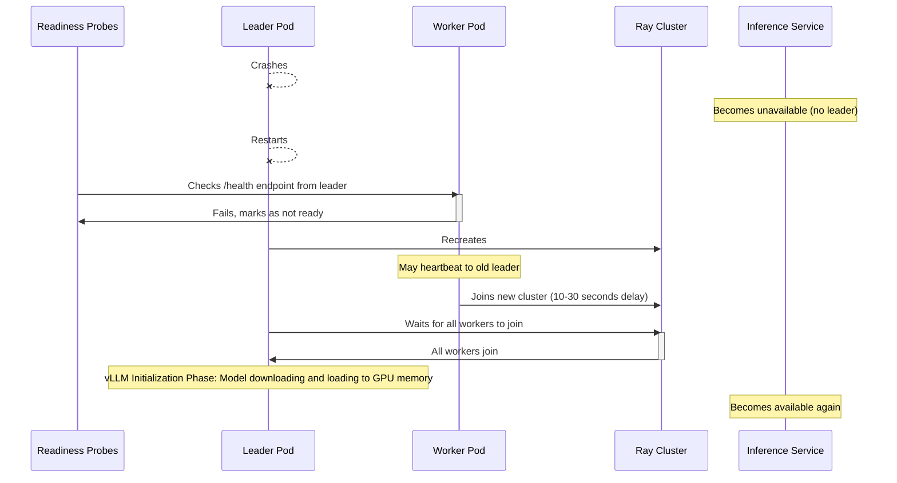
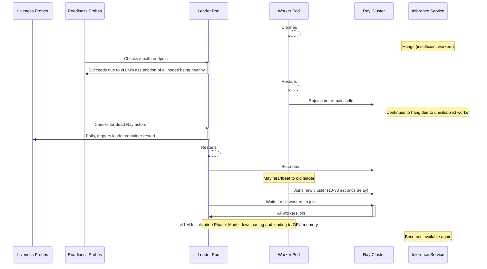

# Title

Distributed Inference

## Summary

While KAITO excels with single-GPU models, the increasing size of state-of-the-art models necessitates multi-node distributed inference capabilities. Models with hundreds of billions of parameters often exceed the memory capacity of even the largest single nodes available today.

The default vLLM runtime lacks multi-node support within KAITO since its adoption in January 2025 ([#823](https://github.com/kaito-project/kaito/pull/823)). This proposal aims to bridge this gap by implementing multi-node distributed inference, primarily focusing on the vLLM runtime. The goal is to enable  deployment of very large preset models across multiple nodes, ensuring KAITO remains capable of serving cutting-edge models while maintaining a consistent user experience.

## What Is Distributed Inference Anyway?

Distributed inference enables models too large for a single GPU to run across multiple GPUs or nodes. Key strategies relevant to KAITO include:

1.  **Single-Node Multi-GPU (Tensor Parallelism):** Splits a model across multiple GPUs *within* a single node. Used when a model fits on one node but exceeds a single GPU's memory. Both HuggingFace Transformers and vLLM support this.
2.  **Multi-Node Multi-GPU (Pipeline and Tensor Parallelism):** Splits a model across multiple nodes, typically using pipeline parallelism between nodes and tensor parallelism within each node. Used for models exceeding a single node's capacity. HuggingFace Transformers supports this via Torch Elastic, but vLLM currently does not in KAITO.

KAITO's current support for these strategies:

| Strategy              |        vLLM        |
| --------------------- | :----------------: |
| Single GPU            |        Yes         |
| Single-Node Multi-GPU |        Yes         |
| Multi-Node Multi-GPU  | No (This proposal) |

### Goals

- Implement multi-node distributed inference for preset models using the vLLM inference runtime in KAITO.

### Non-Goals

- **Applying distributed inference to all preset models:** This proposal specifically targets very large models (e.g., 400B+ parameters) that necessitate multi-node deployment. Applying it to smaller models is not intended, as it could introduce unnecessary overhead and potentially degrade performance.
- **Supporting distributed inference for custom models:** Custom models currently use Kubernetes Deployments, which lack the stable pod identity required for the proposed multi-node coordination using StatefulSets. Extending support to custom models would require a separate effort.
- **Implementing distributed model tuning:** The scope of this proposal is limited to inference. Distributed tuning is not addressed.
- **Introducing new runtimes or deployment mechanisms:** This proposal focuses on enhancing the existing vLLM runtime and StatefulSet deployment strategy, rather than introducing alternatives like LeaderWorkerSet.

## Requirements

### Workspace API Changes

No API changes are needed for the workspace. The existing workspace API implicitly supports multi-node distributed inference, so users can continue using the same Workspace spec without any changes due to the following:

- The number of nodes is specified via `.resource.count` in the Workspace specification:

```yaml
...
resource:
  count: 2
  instanceType: "Standard_ND96asr_v4"
...
```

For pre-provisioned nodes, users may define a list in the existing API `.resource.preferredNodes` to ensure inference deployment to specific nodes:

```yaml
...
resource:
  count: 2
  preferredNodes:
    - my-favorite-node-1
    - my-favorite-node-2
...
```

- [x] For models requiring more than one GPU, validate that `# GPUs/instance × workspace.resource.count ≥ Required # GPUs for a preset model`, and `GPU memory * # GPUs ≥ Required model memory`. This validation is performed in the API server when creating or updating a workspace. If the condition is not met, an error message will be returned to the user. This is already implemented in [`api/v1beta1/workspace_validation.go`](https://github.com/kaito-project/kaito/blob/1815428804593eaa94de0d6f78d82b53e85d0137/api/v1beta1/workspace_validation.go#L293-L380) and does not require any changes.

:::warning
KAITO respects the user-defined `workspace.resource.count` and creates exactly that number of nodes in the Workspace through gpu-provisioner. However, based on the chosen instance type, KAITO may deploy the model on fewer nodes than `workspace.resource.count` if the model can fit in fewer nodes. This behavior is intentional to optimize GPU utilization and reduce overall inter-node communication overhead. Users should be mindful of the cost incurred when specifying a high `workspace.resource.count` if the model can fit in fewer nodes.
:::

### vLLM Runtime Parameters

Flag additions to the vLLM base command is needed to support multi-node distributed inference. Per vLLM's [guidance](https://docs.vllm.ai/en/latest/serving/distributed_serving.html):

- [x] `--tensor-parallel-size`: Set to the number of GPUs per node to configure tensor parallelism. This parameter determines how the model’s tensors are split across GPUs within a single node.
- [ ] `--pipeline-parallel-size`: Set to the number of nodes to configure pipeline parallelism. This parameter determines how different model layers are sharded across nodes.

vLLM uses [Ray](https://www.ray.io/) as the default framework to manage its distributed inference runtime. vLLM has provided a convenient script called [`multi-node-serving.sh`](https://github.com/vllm-project/vllm/blob/main/examples/online_serving/multi-node-serving.sh) to start the Ray server. The same script can be used by worker pods to join the Ray cluster.

Leader:

```bash
...
command:
  - /bin/sh
  - -c
  - |
    # --ray_cluster_size is the number of nodes in the cluster
    /workspace/vllm/multi-node-serving.sh leader --ray_cluster_size=2 --ray_port=6379
    # 8 GPUs per node, 2 nodes
    python3 /workspace/vllm/inference_api.py --tensor-parallel-size=8 --pipeline-parallel-size=2 --served-model-name=super-huge-model --kaito-config-file=/mnt/config/inference_config.yaml
...
```

Workers:

```bash
...
command:
  - /bin/sh
  - -c
  - |
    # --ray_address points to the cluster IP of the headless service of the leader pod
    /workspace/vllm/multi-node-serving.sh worker --ray_address=http://10.1.2.3:6379
...
```

With a StatefulSet, the leader pod can be identified by index `0` in the pod name (e.g., `kaito-vllm-0`), and the worker pod index can be identified by their ordinal indices (e.g., `kaito-vllm-1`, `kaito-vllm-2`, etc.). The Ray cluster address can be constructed using the headless service of the StatefulSet.

```yaml
...
command:
  - /bin/sh
  - -c
  - |
    if [ "${POD_INDEX}" = "0" ]; then
      <leader command>
    else
      <worker command>
    fi
env:
  - name: POD_INDEX
    valueFrom:
      fieldRef:
        fieldPath: metadata.labels['apps.kubernetes.io/pod-index']
...
```

### Liveness and Readiness Probes

Standard HTTP probes are insufficient for multi-node vLLM, as only the leader pod serves the /health endpoint at port 5000, and Ray cluster dynamics in Kubernetes introduce significant complexities. Key challenges include:

- **Leader Dependency and Initialization**: The leader waits for all n-1 worker pods to join the Ray cluster (where n is the StatefulSet replica count) before starting tasks like model downloading and loading it to GPU memory. If a worker pod fails permanently during initialization or restarts later, the leader does not reinitialize the new worker, rendering the vLLM service unusable until the leader is restarted to recreate the Ray cluster from a clean state.
- **Worker Rejoining Delay:** In the case of a leader restart, existing worker pods may take 10-30 seconds to rejoin the new Ray cluster.
- **Ray Actor Health & Count Validation**: The Ray cluster’s health depends on having enough alive actors matching the world size. Dead or missing actors must be detected.
- **Failure Intolerance**: The current design does not tolerate worker or leader pod failures gracefully. Although leader restart does not require all workers to restart, each worker restart requires a leader restart for synchronization purposes, and sequential node upgrades may incur significant downtime.

To address these issues, the following probing strategy is proposed:

|            | Liveness Probe (Triggers Container Restart on Failure)                                                                                                                                                                                                                                                                                                                                                                                                                                                                                                                                                                    | Readiness Probe (Does Not Trigger Container Restart on Failure) |
| ---------- | ------------------------------------------------------------------------------------------------------------------------------------------------------------------------------------------------------------------------------------------------------------------------------------------------------------------------------------------------------------------------------------------------------------------------------------------------------------------------------------------------------------------------------------------------------------------------------------------------------------------------- | --------------------------------------------------------------- |
| **Leader** | Verifies Ray cluster health by querying the Ray dashboard API for the inference workload's job ID and confirming no dead actors associated with that job. If dead actors are found, the probe fails, triggering a container restart to reinitialize the Ray cluster.                                                                                                                                                                                                                                                                                                                                                      | Check `$(LEADER_HEADLESS_SVC):$(VLLM_PORT)/health`.             |
| **Worker** | vLLM does not gracefully handle worker pod restarts (see [vLLM #16259](https://github.com/vllm-project/vllm/issues/16259)), as a restarted worker joins the existing Ray cluster but remains idle, rendering the inference service unusable despite the Ray cluster appearing healthy. That said, implementing a liveness probe for worker pods is unnecessary, as worker health is indirectly validated through the leader’s liveness probe. The leader’s probe, by detecting dead actors, triggers a complete Ray cluster reinitialization, synchronizing both leader and worker pods to restore service functionality. | Check `$(LEADER_HEADLESS_SVC):$(VLLM_PORT)/health`.             |

The following sequential diagram summarizes the expected behavior of the liveness and readiness probes during different failure scenarios:

#### Leader Pod Crash



#### Worker Pod Crash



#### Why Restart the Leader When a Worker Crashes Regardless of the State?

Restarting the leader is important for reinitializing the Ray cluster and synchronizing it with any restarted worker pods. This is due to:

1.  **vLLM's Fault Tolerance Assumption**: In a distributed setup, vLLM operates under the assumption that all nodes remain healthy and available ([source](https://github.com/vllm-project/vllm/blob/d43f914d42dc00a59ca8b6d26363cf02b3b898b2/vllm/executor/ray_distributed_executor.py#L697-L700)). If a worker pod fails, the leader might not correctly recognize this change in the cluster's state, potentially leading to operational inconsistencies.
2.  **State Synchronization**: While restarted worker pods might rejoin the existing Ray cluster, they may not share the same operational state as other pods (e.g., model weights loaded into GPU memory). A leader restart ensures that all pods are synchronized and operate with a consistent state.

#### Example Configuration

Example configuration for the liveness and readiness probes:

```yaml
livenessProbe:
  exec:
    command:
      - /bin/sh
      - -c
      - python3 /workspace/vllm/multi-node-health-check.py liveness --leader-address $(LEADER_HEADLESS_SVC) --ray-port 6379
  initialDelaySeconds: 60
  periodSeconds: 10
  failThreshold: 1
readinessProbe:
  exec:
    command:
      - /bin/sh
      - -c
      - python3 /workspace/vllm/multi-node-health-check.py readiness --leader-address $(LEADER_HEADLESS_SVC) --vllm-port 5000
  periodSeconds: 10
```

The health check script can use the environment variable `POD_INDEX` to determine if the pod is a leader or worker. The probe should also include an initial delay to the liveness probe to allow time for the leader to initialize the Ray cluster and wait for all worker pods to join. This delay is necessary to avoid false positives during the initial startup phase. Failure thresholds should be set to 1 for liveness probes to ensure that any failure in the leader pod triggers an immediate restart instead of waiting for multiple failures.

### Container Image Update

The preset model container images require the following updates:

- [ ] **Include Essential Scripts:** Add the `multi-node-serving.sh` script (sourced from [vLLM examples](https://github.com/vllm-project/vllm/blob/main/examples/online_serving/multi-node-serving.sh)) and the custom `multi-node-health-check.py` script to the Dockerfile. These scripts are necessary for initializing the Ray cluster and performing health checks in a multi-node environment.
- [ ] **Handle Large Model Weights:** For very large models (e.g., 400B+ parameters), embedding weights directly into the container image is impractical due to size constraints. Leverage existing mechanisms for runtime model weight downloading ([#982](https://github.com/kaito-project/kaito/issues/982)) or external weight caching ([#1023](https://github.com/kaito-project/kaito/issues/1023)) to manage these large artifacts effectively.
