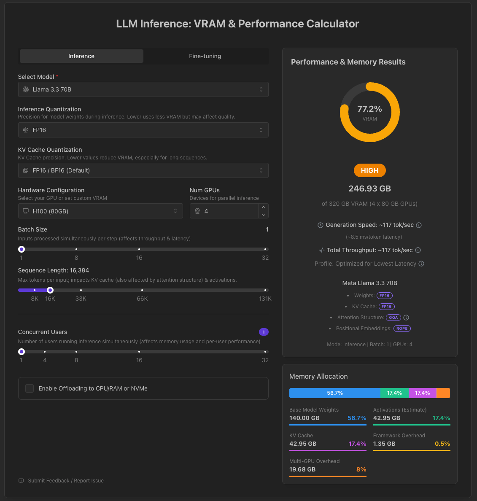

# Title

Add [meta-llama/Llama-3.3-70B-Instruct](https://huggingface.co/meta-llama/Llama-3.3-70B-Instruct) to KAITO supported model list

## Glossary

N/A

## Summary

- **Model description**: The Meta Llama 3.3 multilingual large language model (LLM) is an instruction tuned generative model in 70B (text in/text out). The Llama 3.3 instruction tuned text only model is optimized for multilingual dialogue use cases and outperforms many of the available open source and closed chat models on common industry benchmarks.
- **Model usage statistics**: 700,643 downloads in the last 30 days as of 2025-05-29, according to [Hugging Face](https://huggingface.co/meta-llama/Llama-3.3-70B-Instruct).
- **Model license**: The model is licensed under the [LLAMA 3.3 COMMUNITY LICENSE](https://huggingface.co/meta-llama/Llama-3.3-70B-Instruct/blob/main/LICENSE). Therefore, users must agree to the terms of the license and supply Hugging Face credentials to download the model files.

```yaml
apiVersion: v1
kind: Secret
metadata:
  name: hf-token
  namespace: default
data:
  HF_TOKEN: <base64-encoded-huggingface-token>
type: Opaque
```

In the Workspace configuration, you can specify the secret name to use the Hugging Face token:

```yaml
apiVersion: kaito.sh/v1beta1
kind: Workspace
metadata:
  name: workspace-llama-3-3-70b-instruct
resource:
  instanceType: Standard_ND96isr_H100_v5
  labelSelector:
    matchLabels:
      apps: llama-3-3-70b-instruct
inference:
  preset:
    name: llama-3.3-70b-instruct
    presetOptions:
      modelAccessSecret: hf-token
  config: "llama-inference-params"
```

For a large model, the `max-model-len` value has a significant impact on memory requirements. Currently, you need to provide a configuration that includes the `max-model-len` field. In future versions, Kaito will attempt to estimate memory usage based on the provided parameters. You can specify the config name to use the configmap.


```yaml
apiVersion: v1
kind: ConfigMap
metadata:
  name: "llama-inference-params"
data:
  inference_config.yaml: |
    vllm:
      cpu-offload-gb: 0
      gpu-memory-utilization: 0.95
      swap-space: 4
      max-model-len: 16384
```

## Requirements

The following table describes the basic model characteristics and the resource requirements of running it.

| Field            | Notes                                                                                                                                                |
| ---------------- | ---------------------------------------------------------------------------------------------------------------------------------------------------- |
| Family name      | Llama 3                                                                                                                                              |
| Type             | `conversational`                                                                                                                                     |
| Download site    | https://huggingface.co/meta-llama/Llama-3.3-70B-Instruct/tree/main                                                                                   |
| Version          | [6f6073b423013f6a7d4d9f39144961bfbfbc386b](https://huggingface.co/meta-llama/Llama-3.3-70B-Instruct/commit/6f6073b423013f6a7d4d9f39144961bfbfbc386b) |
| Storage size     | 140GB                                                                                                                                                |
| GPU count        | 4                                                                                                                                                    |
| Total GPU memory | 320GB (~16k context length, more GPUs required for longer context lengths)                                                                           |
| Per GPU memory   | 80GB                                                                                                                                                 |



## Runtimes

This section describes how to configure the runtime framework to support the inference calls.

| Options               | Notes                                                                                                                                                   |
| --------------------- | ------------------------------------------------------------------------------------------------------------------------------------------------------- |
| Runtime               | vLLM                                                                                                                                                    |
| Distributed Inference | True                                                                                                                                                    |
| Custom configurations | max_model_len is set to 131072 by default but users with less GPUs can override it in the Workspace configuration if they want to use a shorter context length. |

# History

- [x] 2025-05-29: Open proposal PR.
- [x] 2025-06-05: Start model integration.
- [x] 2025-06-05: Complete model support.
