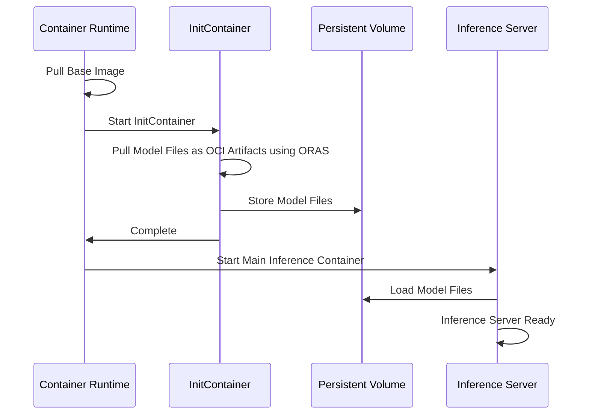
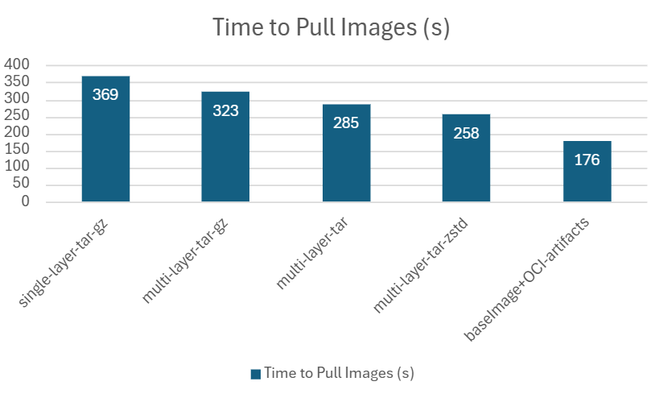

## Summary

The exponential growth and adoption of Large Language Models (LLMs) have revolutionized AI-driven applications across industries. However, distributing these models effectively remains a significant challenge.

Currently, KAITO employs a solution where the runtime library and model files are packaged within a single image. This method ensures a reliable and self-contained environment, particularly effective for distributing small models.

As large language models grow, bundling them within containerized images becomes impractical. Using Open Container Initiative (OCI) Artifacts offers a scalable and efficient alternative for packaging and deployment.

## Motivation

While containerized environments are easy to use, they face challenges in maintaining images and hosting larger models.

### Image Building Challenges

With the ongoing development of KAITO, we now host 19 models. The base images are frequently updated due to vulnerability fixes and feature requests. Each time the base image is updated, we need to rebuild the image for every model.

Although the model files remain unchanged, Docker image builds are still time-consuming because these large files are included in the build context unnecessarily. For instance, building the Falcon-40B image takes nearly 2 hours to complete.

In total, it typically takes around 15 hours to build all of these images.

### Image Pulling Inefficiency

Image pulling is also time-consuming, even for smaller models. For example, it takes around 6 minutes (110s for downloading) to pull the image for Phi-4. Currently, all model files are packed into a single image layer, which limits download concurrency. Splitting the model files into multiple layers could improve bandwidth usage. However, container layer unpacking remains a serial process, which still introduces performance bottlenecks.

#### Containerd Image Pull Process

When containerd pulls an image, the operation is divided into four distinct parts:

1. Downloading layer data from the registry
2. Decompressing the layer if necessary
3. Checking sha256 digest
4. Unpacking the layer, applying changes to the snapshot

Interestingly, testing reveals that the download phase accounts for only 30% of the total time spent during the process. This highlights the significance of optimizing subsequent phases to improve overall efficiency in handling large, containerized artifacts.

### Goals

- Reduce model image build time
- Improve image pull efficiency for larger models
- Create a more maintainable approach to model distribution
- Optimize bandwidth usage through concurrency

### Non-Goals

- Changing the model runtime or inference architecture
- Modifying model weights or structure

## Proposal

To address these challenges, we propose several optimizations for distributing containerized LLM model files:

### Build Image Using ORAS Push

It's quite time-consuming when sending large model files to docker builder context. We propose using ORAS push to add model files to OCI layout assembly. This achieves the same result as Docker build but is much more efficient.

Reference: https://oras.land/docs/commands/oras_push

### Use Zstd Instead of Gzip for Compression

Zstd provides better decompression performance than gzip, which is particularly important for large files like model weights.

Reference: https://depot.dev/blog/building-images-gzip-vs-zstd

### Shipping Model Files as OCI Artifacts

Split the containerized image into two parts:
1. A base image containing the runtime and dependencies
2. OCI artifacts containing the model files

These OCI artifacts can be mounted as an OCI volume in Kubernetes. For older versions of Kubernetes that do not support this feature, an initContainer can be used to fetch the artifacts using ORAS.

Key benefit: You only need to build model images once, then they can be reused across base image updates.

## Design Details

### OCI Artifacts vs OCI Image

The Open Container Initiative (OCI) defines the specifications and standards for container technologies. This includes the API for working with container registries, known formally as the OCI Distribution Specification. (a.k.a. the "distribution-spec").

Specifically, OCI Image Manifests have a required field known as config.mediaType. According to the guidelines provided by OCI Artifacts, this field provides the ability to differentiate between various types of artifacts.

An OCI image is a subset of OCI artifacts, accepting only specific mediatypes.

ORAS is a tool for managing OCI artifacts, including pushing, pulling, and handling metadata in OCI registries. Note that OCI artifacts might not be fully compatible with container engines.
Currently, cri-o supports general OCI artifacts, while [containerd does not](https://github.com/containerd/containerd/issues/11381#issuecomment-2917050414).

### OCI Registries Compatibility

Most OCI registries support OCI artifacts. Check [here](https://oras.land/docs/compatible_oci_registries#registries-supporting-oci-artifacts) for a list of compatible registries.

### Model Files downloading process

Use a initContainer to download model files as OCI artifacts using ORAS. The initContainer will pull the model files from the registry and store them in a persistent volume (PV). The main inference container will then load these model files from the PV.

## Production Readiness Review Questionnaire

### Feature Enablement and Rollback

1. **How can this feature be enabled / disabled in a live cluster?**
   - Feature Gate: Not applicable

2. **Does enabling the feature change any default behavior?**
   - Yes, using the OCI artifacts approach changes how model files are obtained and loaded

3. **Can the feature be disabled once it has been enabled?**
   - No, once OCI artifacts are used, the system will rely on them for model distribution

4. **What happens if we reenable the feature if it was previously rolled back?**
   - No special considerations, the system will start using OCI artifacts for model distribution

5. **Are there any tests for feature enablement/disablement?**
   - We plan to implement integration tests that verify both approaches

### Rollout, Upgrade and Rollback Planning

1. **How can a rollout or rollback fail?**
   - Rollout could fail if OCI registry permissions are incorrect
   - Registry availability issues could cause initContainer failures
   - Rollback could fail if original container images are no longer available

2. **What specific metrics should inform a rollback?**
   - Model download success rate below 99.5%
   - Pod startup time increasing beyond acceptable thresholds

3. **Were upgrade and rollback tested?**
   - Not yet, will be tested in staging environment before production

4. **Is the rollout accompanied by any deprecations and/or removals of features, APIs, fields of API types, flags, etc.?**
   - No deprecations or removals are associated with this feature

### Monitoring Requirements

1. **How can someone determine if the feature is in use by workloads?**
   - Presence of initContainers with ORAS configuration
   - Usage of OCI artifacts in image references

2. **What are the SLIs (Service Level Indicators) an operator can use to determine the health of the service?**
   - **Metrics:**
     - `kaito_model_download_duration_seconds`: Time taken to download model files (histogram)
     - `kaito_model_download_failures_total`: Count of failed model downloads (counter)
     - `kaito_pod_ready_duration_seconds`: Time from pod creation to ready state (histogram)

3. **What are the reasonable SLOs (Service Level Objectives) for the above SLIs?**
   - 99.5% of model downloads complete successfully

4. **Are there any missing metrics that would be useful to have to improve observability?**
   - Network bandwidth utilization during downloads

### Dependencies

1. **Does this feature depend on any specific services running in the cluster?**
   - Requires access to an OCI registry

### Scalability

1. **Will enabling / using this feature result in any new API calls?**
   - Additional API calls to OCI registry during pod initialization

2. **Will enabling / using this feature result in introducing new API types?**
   - No new API types

3. **Will enabling / using this feature result in any new calls to the cloud provider?**
   - Increased storage volume creation requests
   - Increased registry API calls

4. **Will enabling / using this feature result in increasing size or count of the existing API objects?**
   - Slight increase in pod specification size due to initContainer configuration

5. **Will enabling / using this feature result in increasing time taken by any operations?**
   - Pod startup time will increase due to model download step. This is expected and acceptable given the benefits.

6. **Will enabling / using this feature result in non-negligible increase of resource usage?**
   - Temporary increase in network bandwidth during model downloads
   - No significant increase in CPU or memory usage long-term

### Troubleshooting

1. **How does this feature react if the API server and/or etcd is unavailable?**
   - Model downloads depend on OCI registry, not API server
   - Existing pods will continue to function normally

2. **What are other known failure modes?**
   - Registry authentication failures
   - Storage volume provisioning failures
   - Network connectivity issues to registry

3. **What steps should be taken if SLOs are not being met to determine the problem?**
   - Check pod events and logs for initContainer failures
   - Verify registry availability and permissions
   - Check network connectivity between pods and registry
   - Validate storage class configuration and available capacity

## Implementation History

- 2025-06-09: Initial proposal

## Alternatives

### Split Files into Multiple Layers

Add model files to base image using ORAS, keeping each safetensor file as an individual layer to improve download concurrency.

This approach maintains compatibility with standard container runtimes but still has the disadvantage of requiring full image rebuilds when the base image changes. Additionally, our testing shows that the overall image pulling latency is still not good enough for very large models. This is primarily because container layer unpacking remains a [serial process](https://github.com/containerd/containerd/issues/8881), creating a bottleneck regardless of download parallelism.

### Live Download from Hugging Face

Based on our testing, the download bandwidth from ACR is comparable to that of the Hugging Face repository.

While Hugging Face provides comparable bandwidth, ACR is more reliable and better suited for production deployments due to its integration, access control, and enterprise-grade support.

## Test Plan

### Experimental Setup and Results

**Test Environment**: Standard_NC24s_v3 with phi4 model

**Configurations Tested**:

| Configuration | Image | Description |
|---------------|-------|-------------|
| Baseline: single-layer-tar-gz | aimodelsregistrytest.azurecr.io/phi-4:0.1.1 | Current phi4 image. Size 25GB. Pack all model files into one image layer. Compressed using gzip. |
| multilayer-tar-gz | aimodelsregistrytest.azurecr.io/phi-4-mini-instruct:phi4gz | Split model files into individual layers. Each layer compressed using gzip. |
| multilayer-tar | aimodelsregistrytest.azurecr.io/phi-4-mini-instruct:phi4 | Split model files into individual layers. Each layer keeps uncompressed, only packed to a tar pkg. Size 33GB. |
| multilayer-tar-zstd | aimodelsregistrytest.azurecr.io/phi-4-mini-instruct:phi4zstd | Split model files into individual layers. Each layer compressed using zstd. |
| baseImage+OCI-artifacts | aimodelsregistrytest.azurecr.io/base:0.0.3 and aimodelsregistrytest.azurecr.io/phi-4-mini-instruct:model | Pull base image first. Then download model files using oras pull. |

