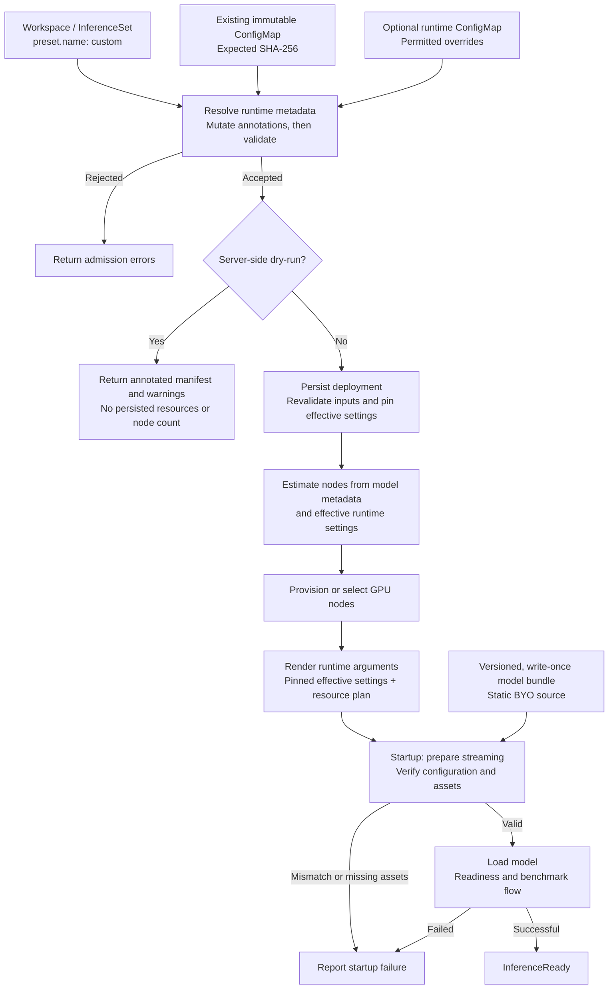

# Bring Your Own Model Weights

## Summary

Allow customers to deploy externally trained or fine-tuned models without registering a KAITO preset or publishing the model to Hugging Face. Customers select `inference.preset.name: custom`, provide the model's `config.json` through a ConfigMap, and serve a complete model directory through the existing static BYO model-mirror/streaming path.

Admission checks configuration compatibility and records the resolved runtime metadata as annotations. Customers can inspect the same result with `kubectl apply --dry-run=server -o yaml`, receiving errors and warnings without creating a deployment or receiving a node count. After admission, KAITO estimates GPU requirements, provisions capacity, renders runtime arguments from the admitted metadata and resource plan, and checks the actual artifacts during serving startup.

KAITO already supports generic Hugging Face model IDs. This proposal adds source-independent configuration assessment and sizing, not another model downloader. The behavior described here is proposed; existing preset and Hugging Face workflows remain unchanged.

## Scope

The initial entry points are `kaito.sh/v1beta1` Workspace and InferenceSet with vLLM. InferenceSet remains the recommended serving API.

A model must have a recognized architecture and configuration covered by KAITO's internal compatibility and memory-estimation rules for the selected runtime. These rules determine supported variants, backend requirements, and parser defaults; they are not a separate model identifier or annotation. Support may include dense, MoE, hybrid, and other architectures, but recognition by vLLM alone is insufficient. Publish the supported combinations with each release and reject uncovered configurations.

| Model representation | Initial support |
|---|---|
| Native BF16, FP16, FP32 | Supported when the architecture/configuration and selected runtime/GPU are covered. |
| Already-serialized FP8 | Supported only for explicitly covered tensor layouts, scales, non-FP8 tensors, and GPU/backend combinations. |
| AWQ, GPTQ, FP4, and other uncovered formats | Not supported. |
| Online quantization | Not supported, including converting BF16/FP16 weights to FP8 at startup. |

FP8 is an explicit exception to the restriction on unsupported quantization formats. Its metadata and execution path must be understood; neither the presence of `quantization_config` nor the string `fp8` alone determines eligibility.

For each admitted architecture/variant, the first release must cover all applicable requirements below. This table defines acceptance prerequisites, not blanket support for every model in each family. Required values may come from explicit config fields or fixed, documented rules of that architecture, never unrelated preset defaults.

| Configuration family | Metadata needed for sizing | Additional runtime requirements |
|---|---|---|
| Dense MHA/GQA/MQA attention | Layer, hidden, attention/KV-head, head, vocabulary, and FFN dimensions; embedding tying and bias layout. | Complete tensor accounting and a built-in loader for the declared variant. |
| Mixture of experts (MoE) | Attention fields plus routed/shared expert counts and FFN dimensions; account for all resident experts. | Supported expert layout and execution backend; experts-per-token is not the resident expert count. |
| Multi-head latent attention (MLA) | Layer/FFN dimensions, KV-LoRA rank, rotary/non-rotary head dimensions, and any expert fields. | Supported projection layout and MLA cache accounting. |
| Attention/recurrent hybrids | Ordered layer types, applicable attention dimensions, state size, convolution kernel, and recurrent head/group dimensions. | Separate attention-cache and recurrent-state accounting, with compatible runtime kernels. |

Each combination also needs a supported checkpoint representation and GPU/backend path. Reject ambiguous or incomplete tensor layouts, missing sizing rules, and runtime dependencies that cannot be derived or supplied by the selected image. Supporting one variant does not admit every fine-tune with the same architecture name.

Customers must supply a complete model directory containing full weights, the matching configuration, tokenizer, and other required serving assets. The initial delivery path streams an existing, versioned BYO artifact rather than downloading a model from Hugging Face.

Custom tuning, adapters, MultiRoleInference, alpha APIs, non-vLLM runtimes, new storage providers/downloaders, model-supplied code, and automatic base-image upgrades are outside the initial scope. Optional runtime overrides through the existing `inference.config` ConfigMap are supported. Changing the model or its resolved runtime settings requires a new deployment.

## API and user workflow

Reserve `custom` as an inference preset name. No new input spec fields, resource kinds, or assessment service are required.

| Annotation | Purpose |
|---|---|
| `inference.kaito.sh/model-config` | Required ConfigMap name in the workload's namespace; the model configuration is stored in `data["config.json"]`. |
| `inference.kaito.sh/model-config-sha256` | Required SHA-256 of the exact UTF-8 bytes of `config.json`. |

Place annotations in `metadata.annotations` for Workspace and `spec.template.metadata.annotations` for InferenceSet. Streaming annotations use the same placement so child Workspaces inherit the complete configuration.

The model ConfigMap must have `immutable: true`. Its digest is the lowercase hexadecimal SHA-256 of the raw `config.json` bytes, not reserialized JSON. Immutability prevents in-place edits; the digest detects changed content if the ConfigMap is deleted and recreated under the same name. Reject missing, misplaced, conflicting, or inapplicable annotations.

The model ConfigMap describes the model itself. An optional same-namespace, immutable `inference.config` ConfigMap supplies runtime overrides in `data["inference_config.yaml"]`; no additional hash annotation is required. KAITO derives model defaults, merges permitted user overrides, and validates the effective settings before sizing or rendering. Custom mode cannot combine a preset with a pod template or use deprecated model-image overrides or HF access credentials to bypass its runtime/source contract.

Assume the `models` namespace exists, model-mirror/streaming is enabled, and a static BYO source and workload identity have been configured. Create an immutable ConfigMap from the exact configuration exported with the weights:

```bash
kubectl create configmap my-model-config-v1 \
  --namespace models \
  --from-file=config.json=./config.json \
  --dry-run=client -o json \
  | jq '.immutable = true' \
  | kubectl apply -f -

sha256sum ./config.json
```

Save the following as `my-model-inferenceset.yaml`, replacing the placeholders with the printed hash and the existing static source settings:

```yaml
apiVersion: kaito.sh/v1beta1
kind: InferenceSet
metadata:
  name: my-model-v1
  namespace: models
spec:
  replicas: 1
  labelSelector:
    matchLabels:
      apps: my-model-v1
  template:
    metadata:
      annotations:
        inference.kaito.sh/model-config: my-model-config-v1
        inference.kaito.sh/model-config-sha256: "<sha256-of-config.json>"
        inference.kaito.sh/static-model-mirror: "true"
        inference.kaito.sh/stream-source-type: "byo"
        inference.kaito.sh/stream-datarefs-url: "<versioned-BYO-data-reference-URL>"
        inference.kaito.sh/stream-identity-client-id: "<workload-identity-client-id>"
    resource:
      instanceType: Standard_NC24ads_A100_v4
    inference:
      preset:
        name: custom
```

The source settings reuse the current static SAS-backed streaming mechanism: the configured workload identity obtains short-lived storage access at pod startup. The data-reference URL identifies the versioned BYO artifact through that mechanism; it is not an arbitrary download URL.

For a direct Workspace, use the same inference settings with annotations at Workspace level and the usual `resource.labelSelector`.

To override runtime defaults, create a ConfigMap such as the following, using a context length supported by the model:

```yaml
apiVersion: v1
kind: ConfigMap
metadata:
  name: my-runtime-v1
  namespace: models
immutable: true
data:
  inference_config.yaml: |
    vllm:
      max-model-len: 2048
```

Reference it with `spec.template.inference.config: my-runtime-v1` on InferenceSet, or `inference.config: my-runtime-v1` on Workspace. Omit the reference to use KAITO's defaults.

```bash
kubectl apply --dry-run=server -f my-model-inferenceset.yaml -o yaml
kubectl apply -f my-model-inferenceset.yaml
```

The model ConfigMap and any referenced runtime ConfigMap must already exist. Dry-running a ConfigMap and an InferenceSet together does not make the ConfigMap available to the webhook. The dry-run output includes derived model-default annotations, but nothing is persisted. Actual submission repeats admission against the installed runtime's capabilities; preflight does not reserve capacity or guarantee that the artifacts will load.

## Compatibility and runtime behavior

Adding annotations requires a **mutating admission webhook**, followed by validating admission; the existing validating webhook alone cannot persist them. On initial creation, mutation reads the verified model configuration, resolves its preset defaults, and returns an annotation patch. Validation checks the final object and optional runtime overrides against the same resolver, including the model-config digest, compatibility rules, and applicable resource requirements. Updates and child creation preserve admitted values as described below. Register both stages for beta Workspace and InferenceSet.

Admission reads Kubernetes resources only and declares `sideEffects: None`. It returns the patch through the admission response rather than writing the workload itself. It performs no HF requests, storage scans, artifact downloads, code execution, or provisioning.

Reject missing architectures, invalid or conflicting dimensions, non-finite values, unsupported configuration variants, incomplete estimator inputs, and unsupported checkpoint/GPU combinations. Nested configuration must be interpreted consistently with the runtime. Descriptive metadata may be retained, but options that change tensor layout, caching, or runtime behavior cannot be silently ignored.

Custom mode uses only implementations included in the selected runtime image. Disable remote-code trust in serving, tokenizer loading, and benchmarking. An `auto_map` field alone is not grounds for rejection if a built-in implementation can load the model without executing those modules. Any required tokenizer mode, backend, or auxiliary dependency must be covered by the compatibility rules and available in that runtime.

Tool-call and reasoning parsers receive architecture-based defaults, with explicit supported settings in `inference.config` taking precedence. If neither a reliable default nor a user choice is available, disable the affected parser and return an admission warning explaining how to configure it. Parser selection does not guarantee that a fine-tuned model emits the expected format. Tokenizer and chat-template assets come from the customer's model bundle, not an assumed parent model.

For custom mode, an explicit empty parser value clears its default. Implement this as a typed merge before serialization: omit the parser flag, and clear derived automatic tool choice when the tool-call parser is disabled. Reject inconsistent explicit combinations rather than forwarding empty values, `disabled`, or YAML booleans blindly.

User overrides may set supported dtype, context/cache parameters, parser choices, and parallelism constraints. Reject overrides that change the resolved model/tokenizer source, enable model code, introduce unsupported quantization, or conflict with the streaming loader. GPU/topology-dependent constraints are checked during resource planning. An explicit context length must fit the validated model limit; otherwise use automatic context fitting.

Before provisioning, the controller re-reads and revalidates the referenced inputs, merges the effective settings, and records them in its controller-owned resolved state. That snapshot drives sizing, CLI generation, and the runtime configuration mounted in serving pods; the Python entrypoint must not independently reload the original user ConfigMap. InferenceSet children reuse the parent's snapshot. No runtime-config digest is introduced: a same-name replacement between admission and initial resolution is revalidated rather than guaranteed to be the originally admitted content. After resolution, replacement must not change the pinned settings.

## Runtime metadata annotations

Today, the [model generator](../../presets/workspace/generator/generator.go#L570) extracts metadata, and [`GetInferenceParameters()`](../../presets/workspace/models/vllm_model.go#L178) turns dtype and parser defaults into `VLLM.ModelRunParams`. [`GetInferenceCommand()`](../../pkg/model/interface.go#L390) adds source and GPU/node-dependent arguments. The [Python entrypoint](../../presets/workspace/inference/vllm/inference_api.py#L128) then appends the runtime ConfigMap's vLLM options. Custom mode must resolve permitted overrides before sizing and rendering, rather than relying only on this late argument append. Model dimensions are not passed wholesale as CLI arguments.

For custom models, admission should persist only the following normalized preset defaults. These are **webhook-owned outputs**, not additional settings customers must supply or the final CLI after user overrides. All values are strings.

| Proposed annotation | Derived from | Consumer and reason to retain it |
|---|---|---|
| `inference.kaito.sh/resolved-architecture` | The supported architecture selected from `architectures[]`. | Populates model metadata used for cache compatibility, DeepGEMM, and CUDA requirements. It is not a `--architecture` argument. |
| `inference.kaito.sh/resolved-dtype` | Normalized `dtype` or legacy `torch_dtype`, interpreted with the checkpoint configuration. | Produces `--dtype=bfloat16`, `float16`, or `float32`; supported serialized-FP8 configurations may use `auto`. Preserves native precision instead of silently defaulting every model to BF16. |
| `inference.kaito.sh/resolved-tool-call-parser` | Architecture-based parser default, or `disabled` when none is reliable. | Produces `--tool-call-parser=<id>` and the corresponding default `--enable-auto-tool-choice`. `disabled` suppresses both defaults; it is never passed as a parser ID. |
| `inference.kaito.sh/resolved-reasoning-parser` | Architecture-based parser default, or `disabled`. | Produces `--reasoning-parser=<id>`, or omits the default. Avoids repeating model-name heuristics during reconciliation. |
| `inference.kaito.sh/resolved-model-context-limit` | Validated context ceiling from `max_position_embeddings` or supported aliases and context-extension rules. | Populates `ModelTokenLimit` for consistent context validation. It does **not** set the serving context: default to `--max-model-len=auto`, unless the user supplies a permitted explicit value. |

Dtype normalization is new behavior: the current generator does not populate it from model JSON, and the wrapper falls back to BF16 for native models. Reject conflicting `dtype`/`torch_dtype` declarations after normalization. `auto` is a CLI setting, not a memory representation: sizing must account for the supported checkpoint's actual weight, scale, and non-FP8 tensor representations.

The webhook writes these annotations at the same locations as the input annotations: Workspace metadata or the InferenceSet template. They contain the selected model metadata directly; no additional identifier is needed to look up another set of defaults.

- **New deployment CREATE:** Derive model defaults from the verified configuration and validate the effective settings including user overrides; caller-supplied resolved annotations are not trusted.
- **UPDATE:** Do not recompute admitted values or pinned settings. Compare model/source and runtime-config references, resolved annotations, and the model-config digest with `oldObject`, rejecting edits or removals while allowing scaling and unrelated metadata changes.
- **Child Workspace CREATE:** Verify the owning InferenceSet's UID and require the child's references, resolved annotations, and model-config digest to match its persisted template. Validate against the parent's pinned effective settings rather than re-reading the original runtime ConfigMap or selecting current controller defaults.

Admission is deterministic and idempotent. Once resolution has completed, reconciliation must reject lost or inconsistent pinned state rather than silently reconstructing different settings from current ConfigMaps or controller defaults.

The operator reconstructs a per-Workspace model from these annotations and the verified model configuration **before** converting metadata into runtime parameters. Setting dtype or parser fields only on the returned `PresetParam.Metadata` is too late: the wrapper has already consumed them. A shared typed merge applies permitted overrides to this baseline; the resulting effective settings drive validation, sizing, and final rendering. Do not concatenate annotation values into a command.

Keep the remaining inputs in their existing sources:

- **Structural dimensions** such as `hidden_size`, layer/head counts, vocabulary size, RoPE settings, and expert/state dimensions stay in `config.json`. They feed loading and the estimator, not corresponding vLLM flags; duplicating them in annotations would create a second model schema.
- **Checkpoint details** remain in the verified configuration and are interpreted by internal compatibility rules. A recognized FP8 checkpoint does not automatically imply `--quantization=fp8` or `--kv-cache-dtype=fp8`; weight layout and cache dtype are separate decisions.
- **Deployment-dependent values** such as tensor/data/pipeline parallelism, GPU utilization, and effective context length come from the estimated model footprint, actual GPU/node allocation, and permitted runtime overrides. They cannot be fixed from model configuration alone.
- **Source paths, tokenizer assets, and code-trust policy** remain source/runtime responsibilities. They are not free-form hyperparameter annotations.

## Model metadata and memory estimation

The current [node estimator](../../pkg/workspace/estimator/nodesestimator/estimator.go#L100) resolves a preset by name and consumes its weight-file size and cache metadata. The existing config parser computes cache/state information, not total model-weight memory. Adding the five runtime annotations alone does not replace this dependency.

Introduce one source-independent model-config parser shared by admission and the controller. It reads the digest-verified ConfigMap, normalizes the full structural configuration, and produces model metadata without HF access. The controller must not resolve `custom` through the preset registry or use an empty model name to bypass sizing.

| Parsed or derived output | Where it is used |
|---|---|
| Architecture, dtype, parser defaults, context ceiling | The five admitted annotations, used to construct runtime model metadata. |
| Full structural configuration and checkpoint layout | Internal parsed metadata for tensor accounting and compatibility; retained in `config.json`, not duplicated into annotations. |
| Estimated resident-weight bytes, KV bytes/token, recurrent-state bytes/sequence, context ceiling, and distributed-execution capability | An explicit model-memory input to the internal estimator request, calculated using the same effective runtime settings as CLI generation. |

Admission checks that complete interpretation and sizing rules exist; it does not return a node estimate. During reconciliation, merge permitted runtime overrides before calculating memory requirements. The custom estimator path consumes this resolved memory input directly, while existing preset/HF paths retain their current resolution behavior. The resulting node/topology plan and the same effective settings drive runtime rendering.

Configuration-derived tensor accounting is new work; neither serialized weight size nor total model memory can be inferred from the existing KV-cache formula alone. Architecture-specific rules calculate:

```text
estimated serving memory =
    resident weights and persistent model buffers
  + FP8 scales and layout allowances where applicable
  + KV cache and hybrid/recurrent state
  + runtime overhead
```

Accounting must include architecture-specific details such as tied embeddings, attention dimensions, and all resident MoE experts, not only active experts. FP8 estimates account for scales, unquantized layers, and backend-specific layout costs; weight dtype and cache dtype are separate inputs.

Reject incomplete or overflowing calculations rather than guessing dimensions, assigning zero memory, or borrowing a parent preset's size. Keep the estimate distinct from observed weight-file size and avoid applying the same overhead twice.

Feed the result into the existing SKU/GPU node estimator and runtime parallelism selection, replacing file-size-dependent decisions for custom models while preserving supported multi-node and BYO-node behavior. Both use the same effective dtype, GPU utilization, cache settings, and parallelism constraints after user overrides. Size cache requirements for the explicit context length when supplied; otherwise use a defined baseline and let runtime `--max-model-len=auto` select the context that fits after loading, not necessarily that baseline or the model's advertised maximum.

No artifact inspection Job or storage lookup is introduced before provisioning. Configuration-only sizing is an estimate: artifacts or runtime allocations can differ, and startup can fail after GPUs are allocated. Such failures must be visible and must not trigger unbounded automatic re-provisioning.

## Deployment lifecycle



1. **Admit:** Resolve model defaults, add derived annotations, and validate them with optional runtime overrides. Server-side dry-run stops here without persisting resources or returning a node count.
2. **Resolve:** Revalidate inputs and record model metadata, effective runtime settings, source identity, and runtime image digest before sizing. InferenceSet passes its admitted annotations and pinned settings to child Workspaces.
3. **Provision:** Estimate the node count, provision or select GPU nodes, and render runtime arguments from the admitted metadata and resource plan.
4. **Check artifacts:** At serving startup, resolve the versioned source, verify the actual `config.json` against the expected digest, and check required tokenizer, configuration, and checkpoint/index assets.
5. **Serve:** Load that model version using its own assets, then complete the configured readiness and benchmark flow.

Static ModelMirror readiness indicates that the source path is prepared; it does not prove artifact correctness. Startup checks happen after capacity allocation and do not require a cryptographic scan of every weight byte. Stage non-weight assets locally if required by the runtime, validate artifact-relative paths, and never treat `custom` as an HF tokenizer or model ID.

The storage owner must provide a versioned, write-once artifact and prevent overwrites throughout streaming. A configuration digest or hash-looking directory name does not make mutable storage immutable. Changed weights require a new artifact version and deployment, even when `config.json` is unchanged. Short-lived storage credentials must not appear in ConfigMaps, status, logs, or identity fingerprints.

The resolved model is identified by its configuration, artifact source, and runtime, not by the shared name `custom`. Keep different models and namespaces isolated. Scale-out must preserve the parent's identity rather than selecting the controller's newest default runtime. Runtime digests must be bundled with release metadata, without admission-time registry lookups.

Model configuration, source, and effective runtime settings are immutable for a custom deployment. Scaling and non-model metadata updates remain available. Controller upgrades must preserve pinned identities; missing or incompatible resolved state must produce an error rather than silently selecting a replacement.

Add optional controller-owned `status.resolvedModel` to Workspace and InferenceSet, recording the configuration digest, pinned runtime image and settings, memory representation used for sizing, and a non-secret source fingerprint. Any rules version needed to reproduce controller decisions belongs in this controller-owned state, not a runtime annotation. Retain `status.targetNodeCount` as the internal deployment result. The default served model name is the InferenceSet name, or the Workspace name for a direct deployment.

Use existing resource/readiness conditions and add `ModelConfigReady` and `ModelArtifactReady` for custom-model progress. Surface failures on the parent InferenceSet as well as its children:

| Failure | User-visible behavior |
|---|---|
| Invalid configuration, digest, or unsupported architecture/format combination | Admission denial identifying the field and corrective action. |
| Invalid runtime override or a setting that conflicts with model/source policy | Admission denial, or `ModelConfigReady=False` if detected during initial resolution; do not provision from invalid settings. |
| Missing or ambiguous parser default | Admission warning; affected parser disabled. |
| Lost/replaced configuration or unavailable pinned runtime state | `ModelConfigReady=False`; no new capacity based on replacement metadata. |
| Resource provisioning failure | Existing resource conditions report the cause. |
| Unavailable source or mismatched/missing artifacts | `ModelArtifactReady=False`; inference is not ready. |
| Model-load failure or OOM | `InferenceReady=False` with actionable failure information. |

Missing dependencies must not prevent deletion, finalizer removal, or legitimate status updates. Scale-out must fail safely when the pinned model identity cannot be honored.

## Compatibility and rollout

`preset.name: custom` is an explicit opt-in. Existing presets, generic HF models, static mirrors, and non-custom upgrade behavior retain their current semantics. New status fields are additive and must survive served-version round trips.

Unsupported API/runtime surfaces or disabled streaming prerequisites produce explicit errors; they must not fall back to HF downloading. Automatic base-image upgrades are not supported for custom mode. Changing the runtime requires a new deployment and explicit cutover.

A controller that does not understand custom mode cannot manage these deployments safely. Cut over to a supported deployment before such a downgrade.

## Acceptance criteria and test plan

- Initial admission and dry-run produce consistent, idempotent annotations. Updates reject pinned-metadata changes, and child Workspaces preserve their verified parent's values and runtime plan. No external model access, side effects, or node-count response occurs.
- The shared parser supplies runtime and estimator metadata without a preset/HF lookup for `custom`. Supported combinations have representative tensor-accounting fixtures, including FP8 scales and non-dense layouts; missing rules or incomplete inputs are rejected, not defaulted to one node.
- Defaults and user overrides produce the same effective settings for sizing and CLI rendering, including dtype, parser selection/clearing, explicit or auto context, and parallelism constraints. Unsupported overrides are rejected; warnings and built-in-only execution remain consistent.
- Artifact/configuration mismatches fail visibly; scale-out preserves pinned effective settings rather than re-reading a replaced runtime ConfigMap. Initial resolution revalidates any replacement since admission. Model identities remain isolated across workloads and namespaces.
- Existing preset behavior, status updates, and cleanup remain unaffected, including when custom dependencies are missing.

Use focused admission and estimator tests, plus the existing GPU CI suites for representative model loading, memory behavior, and replica consistency.
