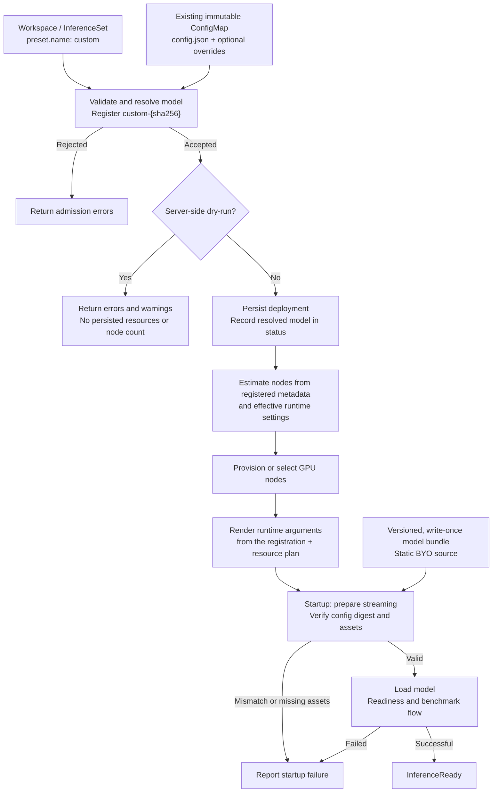

# Bring Your Own Model Weights

## Summary

Deploy externally trained or fine-tuned models without registering a preset or publishing to Hugging Face. Customers select `inference.preset.name: custom`, supply `config.json` through the existing `inference.config` ConfigMap, and serve a complete model directory through existing static BYO model-mirror streaming.

Admission validates that configuration and registers it as a content-addressed model named `custom-<sha256>`, so existing runtime-parameter, CLI-rendering, and sizing code paths resolve it like any other registration. Server-side dry-run reports errors and warnings without creating resources or returning a node count. Deployment then estimates GPU requirements, provisions capacity, renders runtime arguments, and checks artifacts at startup.

This proposal adds source-independent configuration assessment and sizing, not another downloader. Existing preset and Hugging Face workflows remain unchanged.

## Scope

Support `kaito.sh/v1beta1` Workspace and InferenceSet with vLLM; InferenceSet is recommended. Each admitted architecture/configuration must have complete internal compatibility, runtime, and estimation rules. These rules are not another identifier or annotation. Publish supported combinations per release; vLLM architecture recognition alone is insufficient.

| Model representation | Initial support |
|---|---|
| Native BF16, FP16, FP32 | Supported for covered architecture/configuration and runtime/GPU combinations. |
| Already-serialized FP8 | Requires explicit coverage of tensor layout, scales, non-FP8 tensors, and GPU/backend requirements. |
| AWQ, GPTQ, FP4, and other uncovered formats | Not supported. |
| Online quantization | Not supported, including converting BF16/FP16 weights to FP8 at startup. |

FP8 is an explicit exception: neither `quantization_config` nor the string `fp8` alone determines eligibility.

The following are acceptance prerequisites, not blanket family-level support. Values must come from config fields or fixed, documented architecture rules, never unrelated preset defaults.

| Configuration family | Metadata needed for sizing | Additional runtime requirements |
|---|---|---|
| Dense MHA/GQA/MQA attention | Layer count, hidden size, attention/KV-head counts, head dimension, vocabulary/FFN sizes; embedding tying and bias layout. | Complete tensor accounting and a built-in loader. |
| Mixture of experts (MoE) | Attention fields, routed/shared expert counts and FFN dimensions; all resident experts, not only active experts. | Supported expert layout and backend. |
| Multi-head latent attention (MLA) | Layer/FFN dimensions, KV-LoRA rank, rotary/non-rotary head dimensions, and applicable expert fields. | Projection-layout and MLA-cache support. |
| Attention/recurrent hybrids | Ordered layer types, attention dimensions, state size, convolution kernel, recurrent head/group dimensions. | Separate attention-cache/recurrent-state accounting and compatible kernels. |

The bundle must contain full weights, matching configuration, tokenizer, and required serving assets at an existing, versioned BYO source.

The `inference.config` ConfigMap carries the model configuration and optional runtime overrides. Custom tuning, adapters, MultiRoleInference, alpha APIs, non-vLLM runtimes, new storage providers/downloaders, model-supplied code, and automatic base-image upgrades are out of scope. Changed models or effective runtime settings require a new deployment.

## API and user workflow

Reserve `custom` as an inference preset name, and reject user-supplied names beginning with `custom-`, the internal registration prefix. No new spec fields, annotations, resource kinds, or assessment service are required: the existing `inference.config` reference carries the model configuration.

| ConfigMap key | Purpose |
|---|---|
| `config.json` | Required in custom mode. Operator-supplied model configuration, never mounted into the serving pod. |
| `inference_config.yaml` | Optional runtime overrides, as in preset mode. Custom mode does not fall back to the default template. |

The ConfigMap must be same-namespace, already existing, and immutable. Because it now carries both the model configuration and the runtime overrides, changing either requires a new ConfigMap name, and that rename is itself the new deployment this proposal requires. That is the deliberate cost of reusing one object: a runtime-only edit is not distinguishable from a model change.

Custom mode rejects preset/template combinations, deprecated model-image overrides, and HF access credentials. Streaming annotations are unchanged and belong in Workspace `metadata.annotations` or InferenceSet `spec.template.metadata.annotations`; children inherit them. Reject misplaced, conflicting, or inapplicable annotations.

With the namespace, streaming features, static BYO source, and workload identity prepared, create the immutable ConfigMap. Omit `inference_config.yaml` for defaults, or supply vLLM overrides such as a model-supported context length:

```yaml
vllm:
  max-model-len: 2048
```

```bash
kubectl create configmap my-model-v1 \
  --namespace models \
  --from-file=config.json=./config.json \
  --from-file=inference_config.yaml=./inference_config.yaml \
  --dry-run=client -o json \
  | jq '.immutable = true' \
  | kubectl apply -f -
```

Save as `my-model-inferenceset.yaml`, replacing the source placeholders:

```yaml
apiVersion: kaito.sh/v1beta1
kind: InferenceSet
metadata:
  name: my-model-v1
  namespace: models
spec:
  replicas: 1
  labelSelector:
    matchLabels:
      apps: my-model-v1
  template:
    metadata:
      annotations:
        inference.kaito.sh/static-model-mirror: "true"
        inference.kaito.sh/stream-source-type: "byo"
        inference.kaito.sh/stream-datarefs-url: "<versioned-BYO-data-reference-URL>"
        inference.kaito.sh/stream-identity-client-id: "<workload-identity-client-id>"
    resource:
      instanceType: Standard_NC24ads_A100_v4
    inference:
      preset:
        name: custom
      config: my-model-v1
```

The existing SAS-backed mechanism uses workload identity to obtain short-lived storage access at startup. The data-reference URL identifies a versioned artifact, not an arbitrary download URL. For Workspace, move annotations to its metadata, set `inference.config`, and supply `resource.labelSelector`.

```bash
kubectl apply --dry-run=server -f my-model-inferenceset.yaml -o yaml
kubectl apply -f my-model-inferenceset.yaml
```

The ConfigMap must already exist; including it in the same server-side dry-run does not make it available to admission. Because admission is validating only and writes nothing back, dry-run reports its findings as errors and warnings rather than a modified manifest. Actual creation repeats admission. Preflight reserves no capacity and guarantees neither artifact correctness nor successful loading.

## Compatibility and runtime behavior

Extend the existing **validating** admission for beta Workspace and InferenceSet. No mutating stage is introduced, because no derived value is written back to the object. Validation resolves the model through the same resolver the controller uses, then checks runtime overrides and resource requirements. It reads Kubernetes resources only and declares `sideEffects: None`: no resource writes, HF/storage requests, downloads, model-code execution, or provisioning.

Reject missing architectures, invalid/conflicting dimensions, non-finite values, ambiguous layouts, incomplete sizing inputs, and unsupported variants or checkpoint/GPU combinations. Interpret nested configuration consistently with the runtime; never ignore layout, cache, or execution-affecting options. Required tokenizer modes, backends, and dependencies must be understood and present in the runtime image.

Use built-in implementations only, disabling remote-code trust in serving, tokenization, and benchmarking. `auto_map` alone is not disqualifying if the built-in implementation needs no model-supplied code. Tokenizer/chat-template assets come from the bundle, not an assumed parent model.

Supported `inference.config` values override model defaults for dtype, context/cache, parsers, GPU utilization, and parallelism. Use one shared typed merge for validation, sizing, and rendering. Reject source/tokenizer changes, remote-code enablement, unsupported quantization, and streaming-loader conflicts. Validate explicit context against the model limit; otherwise use auto-fit. Check GPU/topology constraints during planning.

Parsers default by architecture. Without a reliable default or explicit selection, disable the affected parser and warn with configuration guidance; a default does not guarantee the fine-tune's output format. An explicit empty parser value clears its default. The typed merge omits disabled flags and clears derived automatic tool choice when disabling the tool parser. Reject inconsistent combinations; never serialize `disabled`, empty parser values, or YAML booleans blindly.

## Model resolution and registration

Custom mode reuses the existing preset generator rather than adding a second parser. Only the generator's Hugging Face front half — repository listing and remote config fetch — is skipped; the ConfigMap's `config.json` is supplied directly, and the source-independent half that derives architecture, dtype, parsers, context limit, and run parameters is reused unchanged. The result is registered in the model registry under `custom-<sha256>`, the SHA-256 of the configuration bytes.

This keeps derived values off the API surface entirely. Runtime parameters, CLI rendering, node estimation, and readiness all read them from the registration, exactly as they do for preset and Hugging Face models, so no `resolved-*` annotations are introduced.

The registry is an in-memory, process-local cache. Content addressing is what makes that safe: a miss is repaired by re-reading the immutable ConfigMap and re-deriving the identical result, so restarts need no extra state and byte-identical configurations across namespaces share one entry. Resolution therefore requires the ConfigMap reference wherever it happens, including node estimation, which today receives only a model name.

Two consequences are deliberate. Derived defaults follow the controller version rather than being pinned, matching existing preset behavior: a controller upgrade combined with a spec change may change derived flags. And the generator's model-name heuristics cannot match `custom-<sha256>`, so architecture-specific defaults come only from configuration; where no reliable default exists, the affected parser is disabled with a warning.

Native dtype parsing is new; the current wrapper defaults native models to BF16. Reject conflicting normalized `dtype`/`torch_dtype`. CLI `auto` is not a memory representation: estimate actual weight, scale, and non-FP8 tensor storage. FP8 weights imply neither `--quantization=fp8` nor FP8 KV cache. Structural dimensions, RoPE, and checkpoint layout stay in the verified `config.json`. Source/tokenizer paths and code-trust policy remain separate responsibilities.

## Model metadata and memory estimation

The [estimator](../../pkg/workspace/estimator/nodesestimator/estimator.go#L100) sizes from a registered model's weight-file size and per-token cache bytes. Preset and Hugging Face models obtain the weight size from an actual file listing, which custom mode has no equivalent of.

That gap is the one genuinely new computation: derive resident weight bytes and per-token cache bytes from configuration alone, through architecture-specific tensor accounting. Everything else the estimator consumes is already produced by the shared generator, so the estimator needs no new inputs beyond the ConfigMap reference required to resolve the model. Never resolve `custom` through the preset registry or bypass sizing with an empty name.

| Parsed or derived output | Where it is used |
|---|---|
| Architecture, dtype, parsers, context ceiling | Runtime parameters and CLI rendering, read from the registration. |
| Structural configuration and checkpoint layout | Internal compatibility/tensor-accounting input; original data stays in `config.json`. |
| Resident-weight bytes, KV bytes/token, recurrent-state bytes/sequence, context ceiling, distributed-execution capability | Explicit estimator input, calculated using the effective runtime settings. |

Admission requires complete interpretation and sizing rules. Reconciliation merges user overrides before estimation; custom sizing consumes the resulting metadata directly. Existing preset/HF resolution remains unchanged.

New architecture-specific tensor accounting calculates:

```text
estimated serving memory =
    resident weights and persistent model buffers
  + FP8 scales and layout allowances where applicable
  + KV cache and hybrid/recurrent state
  + runtime overhead
```

Include tied embeddings, attention dimensions, all resident experts, FP8 scales/unquantized layers, and backend layout costs. Weight and cache dtypes are distinct. Reject incomplete/overflowing calculations; do not guess dimensions, substitute zero/preset sizes, confuse estimates with observed file bytes, or count overhead twice.

Use this footprint in both node estimation and runtime parallelism selection, preserving supported multi-node/BYO behavior. Both must honor the same effective dtype, GPU utilization, cache settings, and topology constraints. Size cache for explicit context when supplied; otherwise use a defined baseline and let runtime auto-fit choose what fits, without promising the advertised maximum.

No artifact-inspection Job or storage lookup precedes provisioning. Actual allocations can exceed estimates; report startup/OOM failures without unbounded automatic re-provisioning.

## Deployment lifecycle



Admission is deterministic and idempotent:

- **CREATE:** Derive everything from the referenced ConfigMap; accept no caller-supplied derived values.
- **UPDATE:** Reject changes to the preset name and to `inference.config`. Model identity is fixed for the object's lifetime; switching models means a new Workspace/InferenceSet and explicit cutover. Allow scaling and unrelated metadata changes.
- **Child Workspace CREATE:** Verify the owner InferenceSet's UID and matching references. Children resolve the same immutable ConfigMap and therefore reach the same registration.

Before sizing or provisioning, the controller resolves the model from the ConfigMap and records its digest in status. Because the ConfigMap is immutable and its reference cannot change, later resolutions reproduce that result. A ConfigMap deleted and recreated with content whose digest no longer matches the recorded one is a failure, not grounds to re-resolve.

At startup, verify the artifact's `config.json` against the digest passed down from the controller, then confirm the required tokenizer/configuration/checkpoint/index assets, before loading that version. The operator-supplied `config.json` is never mounted into the pod; only `inference_config.yaml` is projected from the ConfigMap. Static ModelMirror readiness is not artifact verification. Checks occur after capacity allocation and do not require hashing every weight byte. Stage non-weight assets locally when needed, validate relative paths, and never use `custom` as an HF model/tokenizer ID.

The storage owner must keep artifacts versioned and write-once throughout streaming; a config hash or directory name cannot enforce that. Changed weights require a new version and deployment even if config is unchanged. Never expose short-lived credentials in ConfigMaps, status, logs, or fingerprints.

Identify models by configuration, source, and runtime, not `custom`; isolate workloads/namespaces. Pin runtime image digests from release metadata without admission-time registry lookups, and preserve them on scale-out and controller upgrades.

Add optional controller-owned `status.resolvedModel` with the model-configuration digest, the pinned runtime image, and a non-secret source fingerprint. The digest is both what detects a replaced ConfigMap and what startup verification compares the artifact against. Keep `status.targetNodeCount` as the deployment result. Default the served model name to the InferenceSet name, or direct Workspace name.

Report progress on parent and children using existing conditions plus `ModelConfigReady` and `ModelArtifactReady`:

| Failure | User-visible behavior |
|---|---|
| Invalid model config, unsupported combination, or runtime override | Admission denial identifying the field and remedy; errors during initial resolution set `ModelConfigReady=False` and block provisioning. |
| No reliable parser default or explicit choice | Admission warning; affected parser disabled. |
| Replaced model configuration whose digest no longer matches status | `ModelConfigReady=False`; no new capacity from replacement metadata. |
| Resource provisioning failure | Existing resource conditions report the cause. |
| Unavailable source or mismatched/missing artifacts | `ModelArtifactReady=False`; inference is not ready. |
| Model-load failure or OOM | `InferenceReady=False` with actionable failure information. |

Missing dependencies must not block deletion, finalization, or legitimate status updates. Fail scale-out safely if the recorded model identity cannot be honored.

## Compatibility and rollout

`custom` is opt-in; existing preset/HF/static-mirror and non-custom upgrade behavior stays unchanged. Status additions must survive served-version round trips. Reject unsupported API/runtime surfaces or disabled streaming prerequisites without HF fallback.

Model, source, and effective runtime changes require a new deployment and explicit cutover. Custom base-image auto-upgrades are unsupported. Cut over before downgrading to a controller that cannot manage custom deployments.

## Acceptance criteria and test plan

- Admission and dry-run reach identical conclusions without external access, side effects, or node-count responses, and write nothing back to the object. Updates reject model changes; children reach the same registration.
- Registration is content-addressed and rebuildable: a cold registry reproduces identical metadata from the ConfigMap alone, with no preset/HF lookup or one-node fallback, and user-supplied `custom-` names are rejected. Tensor fixtures cover admitted formats and architectures, including FP8 and non-dense layouts.
- Overrides, parser clearing/warnings, dtype, context, topology, and code-trust policy remain consistent between validation, sizing, and rendering.
- Artifact mismatches fail visibly against the recorded digest; a replaced ConfigMap is reported rather than silently re-resolved; only `inference_config.yaml` reaches the pod; models remain isolated across replicas/namespaces.
- Existing presets, status updates, and cleanup remain unaffected by custom dependencies.

Use focused admission/estimator tests and existing GPU CI for loading, memory behavior, and replica consistency.
