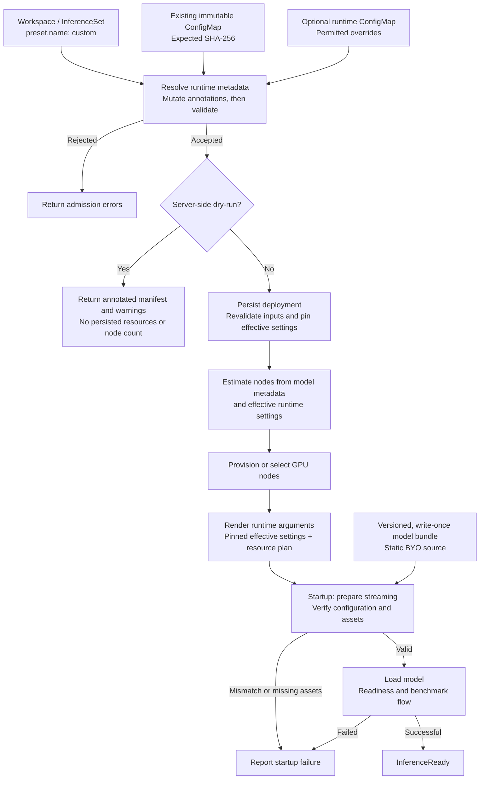

# Bring Your Own Model Weights

## Summary

Deploy externally trained or fine-tuned models without registering a preset or publishing to Hugging Face. Customers select `inference.preset.name: custom`, supply `config.json` through a ConfigMap, and serve a complete model directory through existing static BYO model-mirror streaming.

Admission validates configuration and writes runtime metadata annotations. Server-side dry-run returns the annotated manifest and warnings, without creating resources or returning a node count. Deployment then estimates GPU requirements, provisions capacity, renders runtime arguments, and checks artifacts at startup.

This proposal adds source-independent configuration assessment and sizing, not another downloader. Existing preset and Hugging Face workflows remain unchanged.

## Scope

Support `kaito.sh/v1beta1` Workspace and InferenceSet with vLLM; InferenceSet is recommended. Each admitted architecture/configuration must have complete internal compatibility, runtime, and estimation rules. These rules are not another identifier or annotation. Publish supported combinations per release; vLLM architecture recognition alone is insufficient.

| Model representation | Initial support |
|---|---|
| Native BF16, FP16, FP32 | Supported for covered architecture/configuration and runtime/GPU combinations. |
| Already-serialized FP8 | Requires explicit coverage of tensor layout, scales, non-FP8 tensors, and GPU/backend requirements. |
| AWQ, GPTQ, FP4, and other uncovered formats | Not supported. |
| Online quantization | Not supported, including converting BF16/FP16 weights to FP8 at startup. |

FP8 is an explicit exception: neither `quantization_config` nor the string `fp8` alone determines eligibility.

The following are acceptance prerequisites, not blanket family-level support. Values must come from config fields or fixed, documented architecture rules, never unrelated preset defaults.

| Configuration family | Metadata needed for sizing | Additional runtime requirements |
|---|---|---|
| Dense MHA/GQA/MQA attention | Layer count, hidden size, attention/KV-head counts, head dimension, vocabulary/FFN sizes; embedding tying and bias layout. | Complete tensor accounting and a built-in loader. |
| Mixture of experts (MoE) | Attention fields, routed/shared expert counts and FFN dimensions; all resident experts, not only active experts. | Supported expert layout and backend. |
| Multi-head latent attention (MLA) | Layer/FFN dimensions, KV-LoRA rank, rotary/non-rotary head dimensions, and applicable expert fields. | Projection-layout and MLA-cache support. |
| Attention/recurrent hybrids | Ordered layer types, attention dimensions, state size, convolution kernel, recurrent head/group dimensions. | Separate attention-cache/recurrent-state accounting and compatible kernels. |

The bundle must contain full weights, matching configuration, tokenizer, and required serving assets at an existing, versioned BYO source.

Optional `inference.config` runtime overrides are supported. Custom tuning, adapters, MultiRoleInference, alpha APIs, non-vLLM runtimes, new storage providers/downloaders, model-supplied code, and automatic base-image upgrades are out of scope. Changed models or effective runtime settings require a new deployment.

## API and user workflow

Reserve `custom` as an inference preset name. No new input spec fields, resource kinds, or assessment service are required.

| Annotation | Purpose |
|---|---|
| `inference.kaito.sh/model-config` | Required same-namespace ConfigMap containing `data["config.json"]`. |
| `inference.kaito.sh/model-config-sha256` | Required lowercase hexadecimal SHA-256 of that entry's exact UTF-8 bytes. |

Place model and streaming annotations in Workspace `metadata.annotations` or InferenceSet `spec.template.metadata.annotations`; children inherit them. Reject missing, misplaced, conflicting, or inapplicable annotations.

The model ConfigMap must be immutable. Hash raw bytes, not reserialized JSON: immutability prevents edits, while the digest detects changed content after same-name recreation.

An optional same-namespace, immutable `inference.config` ConfigMap supplies runtime overrides in `data["inference_config.yaml"]`, with no additional hash annotation. Custom mode rejects preset/template combinations, deprecated model-image overrides, and HF access credentials.

With the namespace, streaming features, static BYO source, and workload identity prepared, create the model ConfigMap and calculate its hash:

```bash
kubectl create configmap my-model-config-v1 \
  --namespace models \
  --from-file=config.json=./config.json \
  --dry-run=client -o json \
  | jq '.immutable = true' \
  | kubectl apply -f -

sha256sum ./config.json
```

Save as `my-model-inferenceset.yaml`, replacing the hash and source placeholders:

```yaml
apiVersion: kaito.sh/v1beta1
kind: InferenceSet
metadata:
  name: my-model-v1
  namespace: models
spec:
  replicas: 1
  labelSelector:
    matchLabels:
      apps: my-model-v1
  template:
    metadata:
      annotations:
        inference.kaito.sh/model-config: my-model-config-v1
        inference.kaito.sh/model-config-sha256: "<sha256-of-config.json>"
        inference.kaito.sh/static-model-mirror: "true"
        inference.kaito.sh/stream-source-type: "byo"
        inference.kaito.sh/stream-datarefs-url: "<versioned-BYO-data-reference-URL>"
        inference.kaito.sh/stream-identity-client-id: "<workload-identity-client-id>"
    resource:
      instanceType: Standard_NC24ads_A100_v4
    inference:
      preset:
        name: custom
```

The existing SAS-backed mechanism uses workload identity to obtain short-lived storage access at startup. The data-reference URL identifies a versioned artifact, not an arbitrary download URL. For Workspace, move annotations to its metadata and supply `resource.labelSelector`.

For optional runtime overrides, create a ConfigMap using a model-supported context length:

```yaml
apiVersion: v1
kind: ConfigMap
metadata:
  name: my-runtime-v1
  namespace: models
immutable: true
data:
  inference_config.yaml: |
    vllm:
      max-model-len: 2048
```

Set `spec.template.inference.config: my-runtime-v1` on InferenceSet or `inference.config: my-runtime-v1` on Workspace; omit it for defaults.

```bash
kubectl apply --dry-run=server -f my-model-inferenceset.yaml -o yaml
kubectl apply -f my-model-inferenceset.yaml
```

Referenced ConfigMaps must already exist; including them in the same server-side dry-run does not make them available to admission. Actual creation repeats admission. Preflight reserves no capacity and guarantees neither artifact correctness nor successful loading.

## Compatibility and runtime behavior

Register **mutating then validating admission** for beta Workspace and InferenceSet. Mutation returns model-default annotation patches; validation checks the final object, model digest, runtime overrides, and resource requirements through the same resolver. Both read Kubernetes resources only and declare `sideEffects: None`: no direct resource writes, HF/storage requests, downloads, model-code execution, or provisioning.

Reject missing architectures, invalid/conflicting dimensions, non-finite values, ambiguous layouts, incomplete sizing inputs, and unsupported variants or checkpoint/GPU combinations. Interpret nested configuration consistently with the runtime; never ignore layout, cache, or execution-affecting options. Required tokenizer modes, backends, and dependencies must be understood and present in the runtime image.

Use built-in implementations only, disabling remote-code trust in serving, tokenization, and benchmarking. `auto_map` alone is not disqualifying if the built-in implementation needs no model-supplied code. Tokenizer/chat-template assets come from the bundle, not an assumed parent model.

Supported `inference.config` values override model defaults for dtype, context/cache, parsers, GPU utilization, and parallelism. Use one shared typed merge for validation, sizing, and rendering. Reject source/tokenizer changes, remote-code enablement, unsupported quantization, and streaming-loader conflicts. Validate explicit context against the model limit; otherwise use auto-fit. Check GPU/topology constraints during planning.

Parsers default by architecture. Without a reliable default or explicit selection, disable the affected parser and warn with configuration guidance; a default does not guarantee the fine-tune's output format. An explicit empty parser value clears its default. The typed merge omits disabled flags and clears derived automatic tool choice when disabling the tool parser. Reject inconsistent combinations; never serialize `disabled`, empty parser values, or YAML booleans blindly.

## Runtime metadata annotations

Today, the [generator](../../presets/workspace/generator/generator.go#L570) extracts metadata; [`GetInferenceParameters()`](../../presets/workspace/models/vllm_model.go#L178) converts dtype/parsers into runtime parameters; [`GetInferenceCommand()`](../../pkg/model/interface.go#L390) adds source and GPU/node settings. The [Python entrypoint](../../presets/workspace/inference/vllm/inference_api.py#L128) appends runtime ConfigMap options. Custom mode must merge overrides before sizing, not only at this final step.

Persist these five **webhook-owned model defaults** as string annotations, at the same locations as input annotations. They are neither user inputs nor the final CLI after overrides.

| Proposed annotation | Derived from | Consumer and reason to retain it |
|---|---|---|
| `inference.kaito.sh/resolved-architecture` | Selected supported `architectures[]` entry. | Cache compatibility, DeepGEMM, and CUDA metadata; no `--architecture` flag. |
| `inference.kaito.sh/resolved-dtype` | Normalized `dtype`/legacy `torch_dtype` and checkpoint representation. | `--dtype=bfloat16`, `float16`, or `float32`; covered FP8 configurations may use `auto`. Avoids unintended BF16 fallback. |
| `inference.kaito.sh/resolved-tool-call-parser` | Architecture default or `disabled`. | `--tool-call-parser=<id>` plus derived `--enable-auto-tool-choice`, or neither. |
| `inference.kaito.sh/resolved-reasoning-parser` | Architecture default or `disabled`. | `--reasoning-parser=<id>` or no default; avoids repeating name-based heuristics. |
| `inference.kaito.sh/resolved-model-context-limit` | Validated `max_position_embeddings`, supported aliases, and extension rules. | `ModelTokenLimit` for validation, not serving context. Default CLI remains `--max-model-len=auto` unless explicitly overridden. |

Native dtype parsing is new; the current wrapper defaults native models to BF16. Reject conflicting normalized `dtype`/`torch_dtype`. CLI `auto` is not a memory representation: estimate actual weight, scale, and non-FP8 tensor storage.

Construct per-Workspace model metadata **before** `GetInferenceParameters()` consumes dtype/parser fields; changing returned `PresetParam.Metadata` is too late. Use typed rendering, never command concatenation.

Keep structural dimensions, RoPE, and checkpoint layout in verified `config.json`, not duplicate annotations. FP8 weights imply neither `--quantization=fp8` nor FP8 KV cache. Derive parallelism, GPU utilization, and context from model memory, allocated resources, and permitted overrides. Source/tokenizer paths and code-trust policy remain separate responsibilities.

## Model metadata and memory estimation

The current [estimator](../../pkg/workspace/estimator/nodesestimator/estimator.go#L100) looks up a preset and its weight-file size. Existing config formulas calculate cache/state, not total weights; annotations alone cannot replace this dependency.

Share one source-independent parser between admission and controller. Read the digest-verified ConfigMap and normalize its full configuration; never resolve `custom` through the preset registry or bypass sizing with an empty name.

| Parsed or derived output | Where it is used |
|---|---|
| Architecture, dtype, parsers, context ceiling | The five admitted runtime-metadata annotations. |
| Structural configuration and checkpoint layout | Internal compatibility/tensor-accounting input; original data stays in `config.json`. |
| Resident-weight bytes, KV bytes/token, recurrent-state bytes/sequence, context ceiling, distributed-execution capability | Explicit estimator input, calculated using the effective runtime settings. |

Admission requires complete interpretation and sizing rules. Reconciliation merges user overrides before estimation; custom sizing consumes the resulting metadata directly. Existing preset/HF resolution remains unchanged.

New architecture-specific tensor accounting calculates:

```text
estimated serving memory =
    resident weights and persistent model buffers
  + FP8 scales and layout allowances where applicable
  + KV cache and hybrid/recurrent state
  + runtime overhead
```

Include tied embeddings, attention dimensions, all resident experts, FP8 scales/unquantized layers, and backend layout costs. Weight and cache dtypes are distinct. Reject incomplete/overflowing calculations; do not guess dimensions, substitute zero/preset sizes, confuse estimates with observed file bytes, or count overhead twice.

Use this footprint in both node estimation and runtime parallelism selection, preserving supported multi-node/BYO behavior. Both must honor the same effective dtype, GPU utilization, cache settings, and topology constraints. Size cache for explicit context when supplied; otherwise use a defined baseline and let runtime auto-fit choose what fits, without promising the advertised maximum.

No artifact-inspection Job or storage lookup precedes provisioning. Actual allocations can exceed estimates; report startup/OOM failures without unbounded automatic re-provisioning.

## Deployment lifecycle



Admission is deterministic and idempotent:

- **CREATE:** Derive defaults from verified inputs and validate overrides; do not trust caller-supplied resolved annotations.
- **UPDATE:** Compare model/source/runtime-config references, resolved annotations, and model digest with `oldObject`. Reject edits/removals; allow scaling and unrelated metadata changes without recomputing defaults.
- **Child Workspace CREATE:** Verify the owner InferenceSet's UID and match its template's references, resolved annotations, and model digest. Use its pinned settings, not current ConfigMap contents or controller defaults.

Before sizing or provisioning, the controller re-reads and validates inputs, merges effective settings, and snapshots them. Sizing, CLI generation, and mounted runtime configuration use that snapshot; Python must not reload the original user ConfigMap. Without a runtime-config digest, same-name replacement before this first snapshot is revalidated, not guaranteed identical to admission. Afterward, children and restarts retain pinned settings; lost, inconsistent, or incompatible state is an error, not permission to re-resolve.

At startup, verify the artifact's `config.json` digest and required tokenizer/configuration/checkpoint/index assets before loading that version. Static ModelMirror readiness is not artifact verification. Checks occur after capacity allocation and do not require hashing every weight byte. Stage non-weight assets locally when needed, validate relative paths, and never use `custom` as an HF model/tokenizer ID.

The storage owner must keep artifacts versioned and write-once throughout streaming; a config hash or directory name cannot enforce that. Changed weights require a new version and deployment even if config is unchanged. Never expose short-lived credentials in ConfigMaps, status, logs, or fingerprints.

Identify models by configuration, source, and runtime, not `custom`; isolate workloads/namespaces. Pin runtime image digests from release metadata without admission-time registry lookups, and preserve them on scale-out and controller upgrades.

Add optional controller-owned `status.resolvedModel` with model digest, runtime image/settings, sizing representation, and non-secret source fingerprint. Any internal rules version belongs here, not in an annotation. Keep `status.targetNodeCount` as the deployment result. Default the served model name to the InferenceSet name, or direct Workspace name.

Report progress on parent and children using existing conditions plus `ModelConfigReady` and `ModelArtifactReady`:

| Failure | User-visible behavior |
|---|---|
| Invalid model config/digest, unsupported combination, or runtime override | Admission denial identifying the field and remedy; errors during initial resolution set `ModelConfigReady=False` and block provisioning. |
| No reliable parser default or explicit choice | Admission warning; affected parser disabled. |
| Lost/replaced model configuration or unavailable pinned state | `ModelConfigReady=False`; no new capacity from replacement metadata. |
| Resource provisioning failure | Existing resource conditions report the cause. |
| Unavailable source or mismatched/missing artifacts | `ModelArtifactReady=False`; inference is not ready. |
| Model-load failure or OOM | `InferenceReady=False` with actionable failure information. |

Missing dependencies must not block deletion, finalization, or legitimate status updates. Fail scale-out safely if pinned identity cannot be honored.

## Compatibility and rollout

`custom` is opt-in; existing preset/HF/static-mirror and non-custom upgrade behavior stays unchanged. Status additions must survive served-version round trips. Reject unsupported API/runtime surfaces or disabled streaming prerequisites without HF fallback.

Model, source, and effective runtime changes require a new deployment and explicit cutover. Custom base-image auto-upgrades are unsupported. Cut over before downgrading to a controller that cannot manage custom deployments.

## Acceptance criteria and test plan

- Admission/dry-run produce identical annotations without external access, side effects, or node-count responses; updates and children preserve pinned identity.
- Shared parsing feeds runtime and sizing without preset/HF lookup or one-node fallbacks. Tensor fixtures cover admitted formats and architectures, including FP8 and non-dense layouts.
- Overrides, parser clearing/warnings, dtype, context, topology, and code-trust policy remain consistent between validation, sizing, and rendering.
- Artifact mismatches fail visibly; initial resolution revalidates inputs, later replacements cannot alter snapshots, and models remain isolated across replicas/namespaces.
- Existing presets, status updates, and cleanup remain unaffected by custom dependencies.

Use focused admission/estimator tests and existing GPU CI for loading, memory behavior, and replica consistency.
