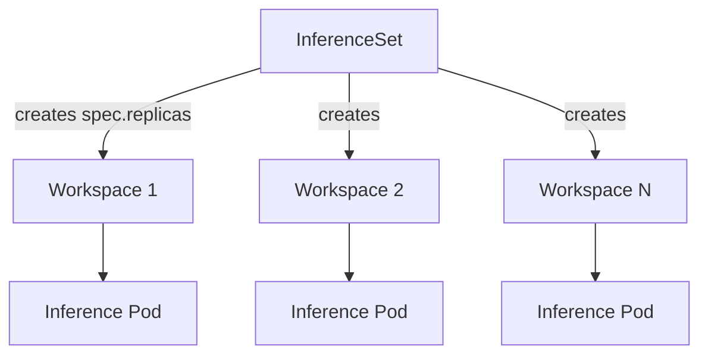

`InferenceSet` is the recommended Custom Resource Definition (CRD) for serving models in production. It supports 
- Serving a model with more than one replica for higher throughput and availability.
- Autoscaling the number of replicas based on inference request load (e.g. with the [KEDA autoscaler](./keda-autoscaler-inference.md)).
- Integrating with the [Gateway API Inference Extension](./gateway-api-inference-extension.md) for KV-cache-aware request routing.

:::info
The `InferenceSet` controller is available starting from KAITO v0.8.0 (alpha) and was promoted to **beta** in KAITO v0.11.0, where it is enabled by default. For older versions, enable it explicitly with `--set featureGates.enableInferenceSetController=true` during installation.
:::

## How it works

An `InferenceSet` is a higher-level controller that creates and manages one inference replica per `spec.replicas`. Every replica is rendered from the same shared `spec.template`, so all replicas serve the same model with the same configuration. The controller continuously reconciles the actual number of replicas to match `spec.replicas`, creating or deleting them as needed. Each replica runs as an independent inference server pod exposing the same OpenAI-compatible API.



## Usage

Deploying a Hugging Face model with `InferenceSet` is straightforward. You just need to specify a Hugging Face model card ID (or a KAITO preset name), the GPU SKU, the desired number of replicas, and a `labelSelector` that the controller applies to each replica. For example:

```yaml
apiVersion: kaito.sh/v1beta1
kind: InferenceSet
metadata:
  name: gemma-4-31b
spec:
  replicas: 2
  labelSelector:
    matchLabels:
      apps: gemma-4-31b
  template:
    resource:
      instanceType: "Standard_NC24ads_A100_v4"
    inference:
      preset:
        name: "google/gemma-4-31B-it"
```

### InferenceSet spec fields

| Field | Required | Description |
| --- | --- | --- |
| `spec.replicas` | No (default `1`) | Desired number of replicas. Set to `0` to scale to zero. |
| `spec.labelSelector` | Yes | Labels applied to each replica so the controller can identify and manage them. |
| `spec.nodeCountLimit` | No | Maximum number of GPU nodes that may be created across all replicas. Unlimited if unset. |
| `spec.template.resource.instanceType` | Yes | GPU node SKU used for every replica. |
| `spec.template.inference.preset.name` | Yes | The model to serve — a Hugging Face model card ID or a KAITO preset name. |
| `spec.template.inference.adapters` | No | One or more LoRA adapters to merge at serving time. |
| `spec.template.inference.config` | No | Name of a ConfigMap holding custom vLLM runtime parameters. |
| `spec.autoUpgrade` | No | Configures automatic base image upgrades of replicas after a controller upgrade. See [Automatic base image upgrades](#automatic-base-image-upgrades). |

### Checking status

The `InferenceSet` status reports how many replicas exist and how many are ready:

```bash
$ kubectl get inferenceset gemma-4-31b
NAME         REPLICAS   READYREPLICAS   AGE
gemma-4-31b   2          2               5m
```

You can also list the individual replicas created by the `InferenceSet`:

```bash
$ kubectl get workspace -l kaito.sh/inferenceset=gemma-4-31b
```

### Scaling

To change the number of replicas, update `spec.replicas`:

```bash
kubectl scale inferenceset gemma-4-31b --replicas=3
```

The controller adds or removes replicas to match the new count. When scaling down, replicas that are not yet ready are removed first. The `InferenceSet` exposes the Kubernetes `scale` subresource, so it can be targeted directly by autoscalers such as HPA or a KEDA `ScaledObject`. For load-based and schedule-based autoscaling, see [Autoscaling Inference with KEDA](./keda-autoscaler-inference.md).

:::note Updating the template
The `InferenceSet` controller reconciles the replica **count** (scaling) and replica labels. It does not currently perform an in-place rolling update of existing replicas when you edit other `spec.template` fields (such as inference parameters or adapters) — the one exception is the base image, which can be rolled out automatically via [Automatic base image upgrades](#automatic-base-image-upgrades). To apply other template changes today, recreate the `InferenceSet` (or delete individual replicas so the controller recreates them from the updated template).
:::

## Serving with custom parameters

You can customize vLLM runtime parameters by creating a ConfigMap containing an `inference_config.yaml` file and referencing it from `spec.template.inference.config`. Every replica created by the `InferenceSet` uses the same parameters. For example:

```yaml
apiVersion: v1
kind: ConfigMap
metadata:
  namespace: myns
  name: my-inference-params
data:
  inference_config.yaml: |
    max_probe_steps: 6
    vllm:
      gpu-memory-utilization: 0.95  # Controls GPU memory usage (0.0-1.0)
      tensor-parallel-size: 2       # Number of GPUs for tensor parallelism
      max-model-len: 131072         # Maximum sequence length
      cpu-offload-gb: 0             # Amount of GPU memory to offload to CPU
---
apiVersion: kaito.sh/v1beta1
kind: InferenceSet
metadata:
  namespace: myns
  name: example
spec:
  replicas: 2
  labelSelector:
    matchLabels:
      apps: example
  template:
    resource:
      instanceType: "Standard_NC24ads_A100_v4"
    inference:
      preset:
        name: "example-model"
      config: "my-inference-params"  # Reference to ConfigMap name
```

Key vLLM parameters include:
- `gpu-memory-utilization`: Controls fraction of GPU memory allocated (between 0.0 and 1.0)
- `tensor-parallel-size`: Number of GPUs to use for tensor parallelism
- `max-model-len`: Maximum sequence length the model can handle

For the complete list of vLLM parameters, refer to the [vLLM documentation](https://docs.vllm.ai/en/latest/serving/engine_args.html).

## Serving with LoRA adapters

KAITO supports serving inference with LoRA adapters produced by [model fine-tuning jobs](./tuning.md). Specify one or more adapters in the `adapters` field of `spec.template.inference`. Each replica created by the `InferenceSet` loads the adapters alongside the raw model weights. For example:

```yaml
apiVersion: kaito.sh/v1beta1
kind: InferenceSet
metadata:
  name: phi4-mini
spec:
  replicas: 2
  labelSelector:
    matchLabels:
      apps: phi4-mini
  template:
    resource:
      instanceType: "Standard_NC24ads_A100_v4"
    inference:
      preset:
        name: "microsoft/Phi-4-mini-instruct"
      adapters:
        - source:
            name: "phi4-mini-adapter"
            image: "<YOUR_IMAGE>"
```

Currently, only images are supported as adapter sources.

**Note:** When building a container image for an existing adapter, ensure all adapter files are copied to the **/data** directory inside the container.

## Inference API

Every replica runs the vLLM runtime and exposes an OpenAI-compatible HTTP API on port 80, reachable through the Kubernetes `Service` of each replica. To distribute requests across all replicas behind a single endpoint, front the `InferenceSet` with the [Gateway API Inference Extension](./gateway-api-inference-extension.md).

**Chat Completions**

```bash
curl -X POST "http://<SERVICE>:80/v1/chat/completions" \
    -H "Content-Type: application/json" \
    -d '{
        "model": "MODEL_NAME",
        "messages": [{"role": "user", "content": "YOUR_PROMPT_HERE"}],
        "max_tokens": 200,
        "temperature": 0.7
    }'
```

**Completions**

```bash
curl -X POST "http://<SERVICE>:80/v1/completions" \
    -H "Content-Type: application/json" \
    -d '{
        "model": "MODEL_NAME",
        "prompt": "YOUR_PROMPT_HERE",
        "max_tokens": 200
    }'
```

**List Models**

```bash
curl -X GET "http://<SERVICE>:80/v1/models"
```

vLLM supports the full set of OpenAI-compatible inference APIs. See the [vLLM OpenAI-compatible server documentation](https://docs.vllm.ai/en/stable/serving/openai_compatible_server.html) for the complete list of endpoints and parameters.

## Automatic base image upgrades

KAITO ships the inference server (vLLM) as a base image embedded in the controller. When you upgrade the KAITO controller to a release that bundles a newer base image, existing replicas keep running their old image until they are recreated. With automatic base image upgrades enabled, the controller detects this version drift and rolls the replicas onto the new image one at a time, waiting for each replica to become ready before moving to the next. This is the rolling-update mechanism KAITO provides for `InferenceSet`.

### When to use
Enable auto-upgrade when you want long-running `InferenceSet` workloads to automatically pick up newer base images (e.g. vLLM bug fixes, performance improvements, or security patches) shipped with KAITO controller upgrades, without manually recreating replicas — while keeping the service available throughout the rollout. If you instead prefer to pin replicas to a fixed base image and control exactly when they change, leave auto-upgrade disabled.

### Enabling auto-upgrade

Auto-upgrade requires two things:

1. The `enableBaseImageAutoUpgrade` feature gate must be enabled on the KAITO controller (it is **off by default**). Enable it at install/upgrade time:

   ```bash
   helm upgrade --install kaito-workspace ./charts/kaito/workspace \
     --set featureGates.enableBaseImageAutoUpgrade=true \
     # ... other values
   ```

2. The `InferenceSet` must opt in via `spec.autoUpgrade.enabled: true`:

   ```yaml
   apiVersion: kaito.sh/v1beta1
   kind: InferenceSet
   metadata:
     name: gemma-4-31b
   spec:
     replicas: 3
     labelSelector:
       matchLabels:
         apps: gemma-4-31b
     template:
       resource:
         instanceType: "Standard_NC24ads_A100_v4"
       inference:
         preset:
           name: "google/gemma-4-31B-it"
     autoUpgrade:
       enabled: true
   ```

### Restricting upgrades to a maintenance window

By default, upgrades may start at any time. To limit when rollouts begin, set a `maintenanceWindow` with a 5-field cron `schedule` (UTC) and an optional `duration` (defaults to `4h`). The controller only starts
upgrading replicas while the current time is inside the window; an upgrade already in progress is allowed to finish even if the window closes, and the next replica waits for the following window.

```yaml
spec:
  autoUpgrade:
    enabled: true
    maintenanceWindow:
      schedule: "0 2 * * 6"   # every Saturday at 02:00 UTC
      duration: "4h"           # window stays open for 4 hours
```

### Observing upgrade progress

The upgrade state is reported under `status.autoUpgrade`:

- `numDriftedWorkspaces` — number of replicas still running an old base image (`0` when fully up-to-date).
- `lastSuccessfulUpgradeTime` — timestamp of the most recently completed replica upgrade.

```bash
kubectl get inferenceset gemma-4-31b -o jsonpath='{.status.autoUpgrade}'
```

## Related documentation

- [Workspace](./workspace.md) - The underlying single-replica CRD and how it works internally.
- [Autoscaling Inference with KEDA](./keda-autoscaler-inference.md) - Load- and schedule-based autoscaling of an `InferenceSet`.
- [Gateway API Inference Extension](./gateway-api-inference-extension.md) - KV-cache-aware routing across `InferenceSet` replicas.
- [Multi-Node Inference](./multi-node-inference.md) - Distributed inference for large models across multiple nodes.

