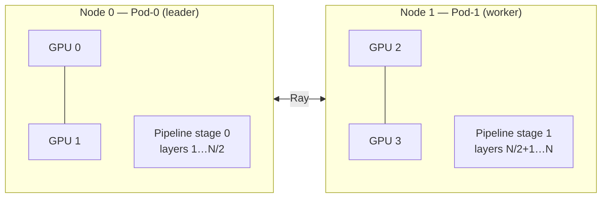

Multi-node inference is used for models that are too large to fit on a single GPU node. KAITO automatically combines **tensor parallelism** within each node and **pipeline parallelism** across nodes so a single model can be served by a coordinated group of pods.

:::note Runtime
Multi-node distributed inference is supported **only with the vLLM runtime**. The `transformers` runtime is single-node only.
:::

## When KAITO uses multi-node inference

Multi-node inference is not something you switch on with a flag — the controller decides automatically. Distributed inference is used when **all three** of these hold (`shouldUseDistributedInference`):

1. **The model supports it** — `Model.SupportDistributedInference()` returns `true`. All vLLM-served models qualify, whether a KAITO preset or a Hugging Face model card ID.
2. **The runtime is vLLM.**
3. **More than one node is required** — `Workspace.Status.TargetNodeCount > 1`.

### How the node count is decided

The number of nodes is computed by KAITO's **node estimator** (`NodeEstimator.EstimateNodeCount`), not taken directly from the spec. The estimator sizes the deployment from:

- the model's total weight size (expanded ~2% for the vLLM in-memory representation),
- the GPU memory and GPU count of the requested `instanceType`,
- the KV-cache requirement for the configured context length, plus a fixed memory overhead and a utilization factor (default `0.84`).

It then picks the smallest node count whose aggregate GPU memory can hold the model plus overhead, and records the result in `status.targetNodeCount`. If that value is greater than `1`, the workspace is served as a multi-node deployment.

```bash
$ kubectl get workspace workspace-large-model
NAME                    INSTANCE                    TARGETNODECOUNT   ...
workspace-large-model   Standard_NC80adis_H100_v5   2                 ...
```

:::info `resource.count` is deprecated
The legacy `resource.count` and `resource.preferredNodes` fields are deprecated in `v1beta1`. You no longer need to specify how many nodes a model needs — KAITO derives it from the model and the GPU SKU. A minimal spec is enough:

```yaml
apiVersion: kaito.sh/v1beta1
kind: Workspace
metadata:
  name: workspace-large-model
resource:
  instanceType: "Standard_NC80adis_H100_v5"
  labelSelector:
    matchLabels:
      apps: large-model
inference:
  preset:
    name: "llama-3.3-70b-instruct"
```
:::

## Parallelism strategy

Based on the model size, the GPU SKU, and the estimated node count, KAITO selects a parallelism layout and injects the corresponding vLLM flags automatically (`configureParallelism`). Users do **not** set these.

| Scenario | vLLM configuration |
| --- | --- |
| Model fits on one GPU | `data-parallel-size = GPUs per node`, `tensor-parallel-size = 1` |
| Model fits on one node (multi-GPU) | `tensor-parallel-size = GPUs per node` |
| Model spans multiple nodes | `tensor-parallel-size = GPUs per node`, `pipeline-parallel-size = number of nodes`, `distributed-executor-backend = ray` |

In the multi-node case, each node holds a slice of the model's layers (a pipeline stage), and within a node those layers are sharded across that node's GPUs (tensor parallel).



## Workload topology: StatefulSet + Ray

For distributed inference KAITO manages the pods with a **StatefulSet** sized to `targetNodeCount` replicas (`GenerateStatefulSetManifest`). A StatefulSet is used because the pods need **stable, ordinal identities** to form a deterministic leader/worker topology:

- **Pod-0 (leader)** starts the Ray cluster head and the vLLM OpenAI API server.
- **Pod-1 … Pod-N (workers)** start Ray and join the leader's cluster; they contribute GPUs to the pipeline but do not serve the API directly.

Each pod learns its role from a `POD_INDEX` environment variable, projected from the Kubernetes pod-ordinal label `apps.kubernetes.io/pod-index`. The model launch command branches on it:

```sh
if [ "${POD_INDEX}" = "0" ]; then
  /workspace/vllm/multi-node-serving.sh leader ...   # Ray head + vLLM API
else
  /workspace/vllm/multi-node-serving.sh worker ...   # Ray worker joins leader
fi
```

Workers find the leader through a **headless Service** that gives every pod a stable DNS name. The leader address is constructed as (`GetRayLeaderHost`):

```
<workspace-name>-0.<workspace-name>-headless.<namespace>.svc.cluster.local
```

Ray cluster communication uses port **6379** (`PortRayCluster`), and the leader is told the expected `ray_cluster_size` so it waits for all workers to join before initialization completes.

## Services and ports

KAITO creates two Services for a distributed workspace:

| Service | Type | Selector | Purpose |
| --- | --- | --- | --- |
| `<name>-headless` | Headless (`clusterIP: None`) | all pods | Per-pod DNS so workers can reach the leader. Uses `publishNotReadyAddresses: true` so names resolve before pods are ready. |
| `<name>` | ClusterIP | **pod-0 only** (`statefulset.kubernetes.io/pod-name=<name>-0`) | Client-facing API endpoint. |

Port mapping on the main Service:

- `80 → 5000` — the vLLM OpenAI-compatible HTTP API (served by the leader).
- `6379` — Ray cluster port.
- `8265` — Ray dashboard.

Because the client Service selects only pod-0, all inference requests land on the leader, which coordinates the pipeline across the worker pods.

## Health probes and fault tolerance

Distributed pods use specialized probes wired up by `SetDistributedInferenceProbe`, all backed by `multi-node-health-check.py`:

- **Startup & readiness probes** call the script in `readiness` mode, which issues an HTTP `GET` to the leader's `http://<leader>:5000/health`. The startup probe tolerates a long window (≈30 minutes by default, ≈60 minutes for models larger than 300 GiB) to allow weights to download and the full cluster to initialize.
- **Liveness probe** (on the leader) calls the script in `liveness` mode, which queries the **Ray GCS** for dead actors. If any worker has died, the probe fails immediately (`failureThreshold: 1`).

When a worker pod fails, the leader's liveness probe detects the dead Ray actor and the leader pod is restarted. Because pipeline parallelism requires a synchronized cluster, restarting the leader forces the whole group to reinitialize: the StatefulSet brings pods back in ordinal order, the leader rebuilds the Ray head, and all workers rejoin. A short `terminationGracePeriodSeconds` keeps this recovery fast.

:::note Future enhancement
KAITO plans to adopt [LeaderWorkerSet](https://lws.sigs.k8s.io/docs/overview/) to provide finer-grained management of leader-worker topologies and improved fault tolerance for multi-node deployments.
:::

## Inference API

A multi-node workspace exposes exactly the same OpenAI-compatible API as a single-node workspace — clients are unaware of the distributed topology. Requests go to the main ClusterIP Service (port 80), which routes to the leader:

```bash
# Health
curl http://<CLUSTER-IP>:80/health

# Chat completions
curl -X POST http://<CLUSTER-IP>:80/v1/chat/completions \
  -H "Content-Type: application/json" \
  -d '{
    "model": "llama-3.3-70b-instruct",
    "messages": [{"role": "user", "content": "Your prompt here"}],
    "max_tokens": 100
  }'
```

## Related documentation

- [Workspace](./workspace.md) - The single-replica CRD and how it works internally.
- [Inference](./inference.md) - Serving models with `InferenceSet`.
- [Presets](./presets.md) - Supported models and their requirements.
