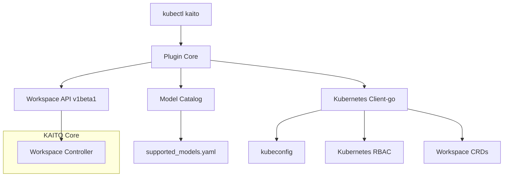

## Summary

Kaito CLI provides a user-friendly kubectl extension for deploying and managing KAITO workspaces on Kubernetes. Kaito kubectl plugin aims to reduce friction for data scientists and ML engineers by abstracting away error-prone YAML authoring and enabling streamlined model deployment workflows. The initial focus is on core deployment and inference scenarios, with potential expansion to a standalone CLI if advanced features beyond kubectl's scope are needed.

## Motivation

Currently, users interact with KAITO by manually crafting Kubernetes YAML manifests. This process is error-prone, unfriendly to non-Kubernetes experts, and slows down experimentation and deployment. As KAITO adoption grows, there is a need for a more accessible, robust, and automation-friendly interface that:

- Reduces the learning curve for new users
- Minimizes configuration errors
- Accelerates model deployment and iteration
- Supports both single-cluster and multi-cluster workflows
- Integrates with CI/CD pipelines and platform automation

### Goals

- Provide a user-friendly kubectl plugin for deploying and managing KAITO workspaces
- Enable rapid model deployment with minimal YAML configuration
- Support core inference scenarios and workspace management
- Integrate seamlessly with existing Kubernetes authentication and RBAC
- Facilitate both interactive use and CI/CD automation

### Non-Goals/Future Work

- Replacing or deprecating existing YAML workflows
- Implementing a web-based GUI (focus is CLI/terminal UX)
- Changing the underlying KAITO resource model or API

## Solution Design

### Kubectl Plugin

A new kubectl plugin distributed through [Krew](https://github.com/kubernetes-sigs/krew) for Kaito that provides seamless integration with existing Kubernetes workflows.

Designed for engineers already comfortable with native Kubernetes tooling. By distributing the plugin through [Krew](https://github.com/kubernetes-sigs/krew), users avoid installing a separate binary, inherit their existing kube-contexts and RBAC, and benefit from familiar `kubectl` verb–noun syntax.

## Core Features and Commands

### Deploy Command

The **deploy** command is the primary entry point for KAITO workspace management, covering both inference and tuning scenarios.

#### Inference Deployment

```bash
# Basic inference deployment with preset model
kubectl kaito deploy --workspace-name my-workspace --model phi-3.5-mini-instruct

# Deploy with specific instance type and node count
kubectl kaito deploy --workspace-name my-workspace --model llama-3.1-8b-instruct \
  --instance-type Standard_NC96ads_A100_v4 --count 2

# Deploy with model access secret for gated models
kubectl kaito deploy --workspace-name my-workspace --model llama-3.3-70b-instruct \
  --model-access-secret hf-token

# Deploy with single adapter
kubectl kaito deploy --workspace-name my-workspace --model phi-3-mini-128k-instruct \
  --adapter phi-3-adapter="myregistry.azurecr.io/adapters/phi-3-adapter:v1",strength=1.0

# Deploy with multiple adapters
kubectl kaito deploy --workspace-name my-workspace --model phi-3-mini-128k-instruct \
  --adapter adapter1="myregistry.azurecr.io/adapters/adapter1:v1",strength=0.8 \
  --adapter adapter2="myregistry.azurecr.io/adapters/adapter2:v1",strength=1.0 \
  --adapter adapter3="myregistry.azurecr.io/adapters/adapter3:v1",strength=0.5

# Deploy with custom inference configuration
kubectl kaito deploy --workspace-name my-workspace --model deepseek-r1-distill-qwen-14b \
  --inference-config ds-inference-params

# Deploy with specific node preferences  
kubectl kaito deploy --workspace-name my-workspace --model mistral-7b-instruct \
  --preferred-nodes node1,node2 --instance-type Standard_NC24ads_A100_v4

# Deploy with label selector for node targeting
kubectl kaito deploy --workspace-name my-workspace --model qwen2.5-coder-7b-instruct \
  --label-selector apps=qwen-2-5-coder

# Deploy with special annotations for testing
kubectl kaito deploy --workspace-name my-workspace --model falcon-7b-instruct \
  --bypass-resource-checks --enable-load-balancer

# Deploy with dry-run to generate YAML manifest
kubectl kaito deploy --workspace-name my-workspace --model phi-4-mini-instruct --dry-run
```

#### Tuning Deployment

```bash
# Deploy QLoRA tuning with URL input and image output
kubectl kaito deploy --workspace-name workspace-tuning-phi-3 --model phi-3-mini-128k-instruct \
  --tuning --tuning-method qlora \
  --input-urls "https://huggingface.co/datasets/philschmid/dolly-15k-oai-style/resolve/main/data/train-00000-of-00001-54e3756291ca09c6.parquet?download=true" \
  --output-image "myregistry.azurecr.io/adapters/phi-3-tuned:v1" \
  --output-image-push-secret my-registry-secret

# Deploy QLoRA tuning with custom configuration
kubectl kaito deploy --workspace-name workspace-tuning-falcon-7b --model falcon-7b \
  --tuning --tuning-method qlora --tuning-config qlora-params-template \
  --input-urls "https://huggingface.co/datasets/philschmid/dolly-15k-oai-style/resolve/main/data/train-00000-of-00001-54e3756291ca09c6.parquet?download=true" \
  --output-image "myregistry.azurecr.io/adapters/falcon-7b-tuned:v1" \
  --output-image-push-secret my-registry-secret

# Deploy tuning with PVC volume sources
kubectl kaito deploy --workspace-name workspace-tuning-phi-3-pvc --model phi-3-mini-128k-instruct \
  --tuning --tuning-method qlora \
  --input-pvc pvc-azurefile-input \
  --output-pvc pvc-azurefile-output \
  --instance-type Standard_NC6s_v3

# Deploy tuning with private model image
kubectl kaito deploy --workspace-name workspace-tuning-falcon-7b-private --model falcon-7b \
  --tuning --tuning-method qlora --tuning-config my-qlora-params \
  --model-access-mode private \
  --model-image "aimodelsregistry.azurecr.io/kaito-falcon-7b:0.0.4" \
  --input-urls "https://huggingface.co/datasets/philschmid/dolly-15k-oai-style/resolve/main/data/train-00000-of-00001-54e3756291ca09c6.parquet?download=true" \
  --output-image "myregistry.azurecr.io/adapters/falcon-7b-private:v1" \
  --output-image-push-secret my-registry-secret
```

#### Supporting Commands

```bash
# Check workspace status with detailed information
kubectl kaito status --workspace-name my-workspace
kubectl kaito status --workspace-name my-workspace --show-conditions
kubectl kaito status --workspace-name my-workspace --show-worker-nodes

# Get workspace inference endpoint
kubectl kaito get-endpoint --workspace-name my-workspace

# Interactive chat with deployed model
kubectl kaito chat --workspace-name my-workspace
kubectl kaito chat --workspace-name my-workspace --system-prompt "You are a helpful coding assistant"
kubectl kaito chat --workspace-name my-workspace --temperature 0.7 --max-tokens 2048

# List supported models
kubectl kaito models list
kubectl kaito models list --type text-generation
kubectl kaito models describe phi-3.5-mini-instruct
kubectl kaito models describe llama-3.1-8b-instruct --show-runtime-info
```

### New Core Commands

#### Get-Endpoint Command

The `get-endpoint` command retrieves the inference service endpoint for a deployed workspace, making it easy to programmatically access the model API.

```bash
# Get endpoint URL
kubectl kaito get-endpoint --workspace-name my-workspace
# Output: http://workspace-my-workspace.default.svc.cluster.local:80/chat/completions

# Get external endpoint when LoadBalancer is enabled
kubectl kaito get-endpoint --workspace-name my-workspace --external
# Output: http://20.123.45.67:80/chat/completions
```

#### Chat Command

The `chat` command provides an interactive chat interface with deployed models, similar to Ollama's CLI experience.

```bash
# Start basic interactive chat session
kubectl kaito chat --workspace-name my-workspace

# Chat with custom system prompt
kubectl kaito chat --workspace-name my-workspace --system-prompt "You are a helpful coding assistant specialized in Python"

# Chat with inference parameters
kubectl kaito chat --workspace-name my-workspace --temperature 0.7 --max-tokens 2048 --top-p 0.9

# Single question mode (non-interactive)
kubectl kaito chat --workspace-name my-workspace --message "Explain machine learning in simple terms"

# Chat with custom API parameters
kubectl kaito chat --workspace-name my-workspace --stream=false --echo=true
```

**Interactive Chat Session Example:**

```
$ kubectl kaito chat --workspace-name code-assistant
Connected to workspace: code-assistant (model: phi-3.5-mini-instruct)
Type /help for commands or /quit to exit.

>>> Write a Python function to calculate fibonacci numbers
def fibonacci(n):
    if n <= 1:
        return n
    return fibonacci(n-1) + fibonacci(n-2)

>>> Can you optimize this for better performance?
Here's an optimized version using dynamic programming:

def fibonacci_optimized(n):
    if n <= 1:
        return n
    
    a, b = 0, 1
    for _ in range(2, n + 1):
        a, b = b, a + b
    return b

>>> /help
Available commands:
  /help        - Show this help message
  /quit        - Exit the chat session
  /clear       - Clear the conversation history
  /model       - Show current model information
  /params      - Show current inference parameters
  /set <param> <value> - Set inference parameter (temperature, max_tokens, etc.)

>>> /quit
Chat session ended.
```

### Complete Workflow Examples

#### Deploy Phi-3.5 for Code Generation

```bash
# 1. List available models to find code-generation models
kubectl kaito models list --type text-generation
# Output shows: phi-3.5-mini-instruct, qwen2.5-coder-7b-instruct, etc.

# 2. Get details about the model
kubectl kaito models describe phi-3.5-mini-instruct
# Shows: runtime=tfs, version, tag, etc.

# 3. Deploy the model for inference
kubectl kaito deploy --workspace-name workspace-phi-3-5-mini \
  --model phi-3.5-mini-instruct \
  --instance-type Standard_NC24ads_A100_v4 \
  --label-selector apps=phi-3-5

# 4. Check deployment status
kubectl kaito status --workspace-name workspace-phi-3-5-mini --show-conditions
# Shows: ResourceReady, InferenceReady conditions

# 5. Retrieve workspace endpoint (once ready)
kubectl kaito get-endpoint --workspace-name workspace-phi-3-5-mini
# Output: http://workspace-phi-3-5-mini.default.svc.cluster.local:80/chat/completions

# 6. Test the model with interactive chat
kubectl kaito chat --workspace-name workspace-phi-3-5-mini --system-prompt "You are a code generation assistant"
```

#### Fine-tune Phi-3 with QLoRA

```bash
# 1. Deploy QLoRA tuning job with Dolly dataset
kubectl kaito deploy --workspace-name workspace-tuning-phi-3 \
  --model phi-3-mini-128k-instruct \
  --tuning --tuning-method qlora \
  --input-urls "https://huggingface.co/datasets/philschmid/dolly-15k-oai-style/resolve/main/data/train-00000-of-00001-54e3756291ca09c6.parquet?download=true" \
  --output-image "myregistry.azurecr.io/adapters/phi-3-tuned:v1" \
  --output-image-push-secret my-registry-secret \
  --instance-type Standard_NC24ads_A100_v4 \
  --label-selector app=tuning-phi-3

# 2. Monitor tuning progress
kubectl kaito status --workspace-name workspace-tuning-phi-3 --show-conditions

# 3. Check if tuning completed successfully
kubectl kaito status --workspace-name workspace-tuning-phi-3
# Look for WorkspaceSucceeded condition

# 4. Deploy the tuned model with adapter
kubectl kaito deploy --workspace-name workspace-phi-3-mini-adapter \
  --model phi-3-mini-128k-instruct \
  --adapter phi-3-adapter="myregistry.azurecr.io/adapters/phi-3-tuned:v1",strength=1.0 \
  --label-selector apps=phi-3-adapter

# 5. Test the fine-tuned model
kubectl kaito status --workspace-name workspace-phi-3-mini-adapter --show-conditions
kubectl kaito get-endpoint --workspace-name workspace-phi-3-mini-adapter

# 6. Chat with the fine-tuned model to test improvements
kubectl kaito chat --workspace-name workspace-phi-3-mini-adapter --message "Generate a helpful response using the training data knowledge"
```

#### Deploy Llama-3.3 70B with Multi-Node Setup

```bash
# 1. Create secret for HuggingFace token (required for gated model)
kubectl create secret generic hf-token --from-literal=token=hf_your_token_here

# 2. Deploy the large model with multi-node configuration
kubectl kaito deploy --workspace-name workspace-llama-3-3-70b-instruct \
  --model llama-3.3-70b-instruct \
  --model-access-secret hf-token \
  --instance-type Standard_NC48ads_A100_v4 \
  --count 2 \
  --label-selector apps=llama-3-3-70b-instruct

# 3. Check status
kubectl kaito status --workspace-name workspace-llama-3-3-70b-instruct --show-worker-nodes

# 4. Get the service endpoint once ready
kubectl kaito get-endpoint --workspace-name workspace-llama-3-3-70b-instruct --format json
# Output: {"url": "http://workspace-llama-3-3-70b-instruct.default.svc.cluster.local:80", "ready": true}

# 5. Test the large model with a complex question
kubectl kaito chat --workspace-name workspace-llama-3-3-70b-instruct --temperature 0.3 --max-tokens 1024
```

#### Deploy RAG Engine with Phi-3

```bash
# 1. First deploy a workspace for inference (if not using external URL)
kubectl kaito deploy --workspace-name workspace-phi-3-inference \
  --model phi-3.5-mini-instruct \
  --instance-type Standard_NC6s_v3

# 2. Deploy RAG engine with local embedding model
kubectl kaito rag deploy --ragengine-name ragengine-start \
  --embedding-model "BAAI/bge-small-en-v1.5" \
  --inference-workspace workspace-phi-3-inference \
  --instance-type Standard_NC6s_v3 \
  --label-selector apps=ragengine-example

# 3. Check RAG engine status
kubectl kaito status ragengine/ragengine-start

# 4. Query the RAG system
  kubectl kaito rag query --ragengine ragengine-start --question "What is KAITO?"
```

## Technical Architecture

### Implementation Architecture

The kubectl plugin will be developed in a separate repository under the `kaito-project` organization on GitHub: `github.com/kaito-project/kaito-cli`.



## POC/Demo

- [kubectl-kaito demo repository](https://github.com/helayoty/kubectl-kaito)
