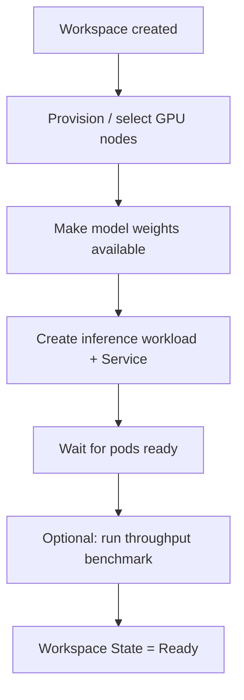

The `Workspace` Custom Resource Definition (CRD) is KAITO's low-level building block for model serving. A single `Workspace` provisions GPU capacity and runs **one** inference replica of a model. This document focuses on how a `Workspace` works internally — the reconcile lifecycle, how model weights reach the pod, what workload is created, and the status conditions it reports.

:::tip Recommended entry point
[`InferenceSet`](./inference.md) is the **recommended way to serve models** in KAITO. It builds on top of `Workspace`, managing multiple replicas behind a single specification and enabling autoscaling, rolling base-image upgrades, and gateway-based routing. Reach for `Workspace` directly only when you want a single replica or need to understand the underlying mechanics.
:::

## How a Workspace works

When you create a `Workspace`, the KAITO controller drives it through a reconcile lifecycle from raw spec to a ready inference service:



Each step is reflected in the `Workspace` status conditions (see [Status conditions](#status-conditions)). The following sections explain what happens internally at each step.

### Node provisioning and selection

The controller first ensures enough GPU nodes exist to satisfy the `resource` spec. Based on the requested `instanceType`, KAITO provisions GPU nodes (for example, by creating `NodeClaim` objects through the GPU provisioner) and waits until the nodes are `Ready` with their vendor GPU device plugins reporting allocatable GPUs. The matching `labelSelector` labels are applied so the inference pods land on those nodes.

For on-premise clusters where GPU SKUs cannot be provisioned dynamically, nodes can be pre-configured and supplied directly. The user must ensure the vendor-specific GPU plugin is installed on every prepared node — i.e. the node's `status.allocatable` reports a non-zero GPU resource:

```
$ kubectl get node $NODE_NAME -o json | jq .status.allocatable
{
  "cpu": "XXXX",
  "ephemeral-storage": "YYYY",
  "hugepages-1Gi": "0",
  "hugepages-2Mi": "0",
  "memory": "ZZZZ",
  "nvidia.com/gpu": "1",
  "pods": "100"
}
```

When node names are listed in the `preferredNodes` field of the `resource` spec, the controller skips GPU node provisioning and schedules the workload onto those prepared nodes.

:::warning
The node objects of the preferred nodes need to contain the same matching labels as specified in the `resource` spec. Otherwise, the KAITO controller would not recognize them.
:::

A minimal `Workspace` only needs the GPU SKU in the `resource` spec and a model name in the `inference` spec:

```yaml
apiVersion: kaito.sh/v1beta1
kind: Workspace
metadata:
  name: workspace-gemma4-31b
resource:
  instanceType: "Standard_NC24ads_A100_v4"
  labelSelector:
    matchLabels:
      apps: gemma4-31b
inference:
  preset:
    name: "google/gemma-4-31B-it"
```

Starting from KAITO v0.9.0, generic Hugging Face models are supported on a best-effort basis: specifying a Hugging Face model card ID (for example `Qwen/Qwen3-0.6B`) as `inference.preset.name` runs any model whose architecture is supported by vLLM.

### Downloading model weights into the pod

Depending on the model and configuration, the controller makes weights available to the inference container in one of two ways:

- **Runtime download** — the controller injects an init container that downloads the weights (e.g. from Hugging Face, using the secret referenced by `inference.preset.presetOptions.modelAccessSecret`) into a shared `EmptyDir` volume before the inference server starts.
Weights will be downloaded to local NVMe disks when available.
- **Model streaming** — when streaming is enabled, weights are served from cloud storage and streamed into the pod instead of being fully downloaded first. See [Model Mirror & Streaming](./model-mirror-streaming.md).

When adapters are specified, an additional init container is added per adapter to fetch the adapter data into the same shared volume (see [Serving with LoRA adapters](./inference.md#serving-with-lora-adapters)).

### Inference workload and Service

From v0.8.0 onwards, KAITO manages the inference service with a Kubernetes **StatefulSet** (older `Deployment`-based workloads are automatically migrated). The StatefulSet gives pods stable identities, which is required for multi-node distributed inference where leader and worker pods must coordinate. For single-node models the StatefulSet simply runs one replica.

The inference server is exposed through a `ClusterIP` Kubernetes `Service` (port 80 by default). For multi-node distributed inference, a headless Service is additionally created for pod-to-pod discovery. See [Multi-Node Inference](./multi-node-inference.md) for the distributed architecture.

### Inference benchmark

When using the vLLM runtime, KAITO automatically runs a post-load throughput benchmark (via [guidellm](https://github.com/neuralmagic/guidellm)) after the model loads and before marking the workspace as ready. The benchmark result is stored in `status.performance.metrics` and the `BenchmarkCompleted` condition is set on the workspace.

To disable the benchmark, set the `kaito.sh/disable-benchmark` annotation to `"true"` on a Workspace or InferenceSet:

```yaml
apiVersion: kaito.sh/v1beta1
kind: Workspace
metadata:
  name: workspace-phi-4-mini
  annotations:
    kaito.sh/disable-benchmark: "true"
resource:
  instanceType: "Standard_NC24ads_A100_v4"
  labelSelector:
    matchLabels:
      apps: phi-4-mini
inference:
  preset:
    name: "microsoft/Phi-4-mini-instruct"
```

When set on an InferenceSet, the annotation is propagated to all child Workspaces it creates.

### Status conditions

The controller reports progress through `status.conditions`. The most relevant ones are:

| Condition | Meaning |
| --- | --- |
| `ResourceReady` | The required GPU nodes are provisioned and ready. |
| `InferenceReady` | The inference StatefulSet has its desired replicas ready. |
| `BenchmarkCompleted` | The optional post-load throughput benchmark finished (vLLM only). |
| `WorkspaceSucceeded` | Summary condition: resources and inference are ready. |

When inference is ready (and the benchmark, if enabled, has completed), `status.state` becomes `Ready`.
