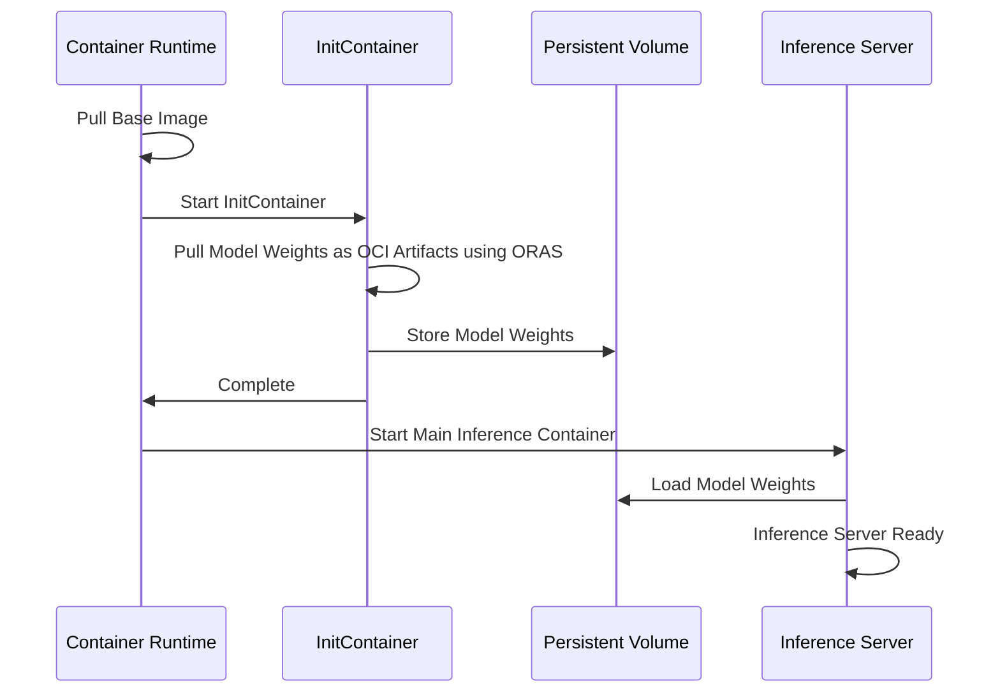

# Model As OCI Artifacts

KAITO efficiently distributes Large Language Models (LLMs) by leveraging Open Container Initiative (OCI) Artifacts to package and deploy model weights separately from the inference runtime. This architecture provides superior performance, scalability, and maintainability for large language model deployments.

## Overview

KAITO uses a split architecture approach for model distribution:

- **Base Images**: Contain the inference runtime and dependencies
- **OCI Artifacts**: Contain the model weights and configuration files stored separately in OCI registries

This design choice enables KAITO to optimize both build and deployment performance while maintaining compatibility with standard container infrastructure. The model weights are downloaded as OCI artifacts during pod initialization, providing faster deployment times and more efficient resource utilization compared to traditional monolithic container images.

## Design Rationale

KAITO chose the OCI Artifacts approach to address fundamental challenges in large language model distribution and deployment:

### Build Efficiency

By separating model weights from base images, KAITO eliminates redundant rebuilds:

- **Reduced Build Time**: Model images only need to be built once and can be reused across base image updates
- **Efficient Build Context**: Large model files are not included in Docker build context, avoiding unnecessary transfers
- **Resource Optimization**: Build processes for large models like Falcon-40B are reduced from nearly 2 hours to minutes

### Deployment Performance

KAITO's OCI Artifacts approach optimizes the deployment pipeline:

- **Concurrent Downloads**: Model weights can be downloaded in parallel, improving bandwidth utilization
- **Advanced Compression**: Zstd compression provides better decompression performance than traditional gzip
- **Optimized Unpacking**: Separate artifact handling reduces serialization bottlenecks during pod startup

#### Understanding Container Performance

KAITO's design optimizes all phases of the container pull process:

1. **Downloading** layer data from the registry
2. **Decompressing** the layer if necessary  
3. **Checking** sha256 digest
4. **Unpacking** the layer, applying changes to the snapshot

KAITO addresses these performance characteristics by optimizing not just the download phase (30% of total time) but also the decompression, validation, and unpacking phases through its OCI Artifacts approach.

## How KAITO Uses OCI Artifacts

### 1. Efficient Build Process

KAITO uses [ORAS](https://github.com/oras-project/oras) to package model weights and configuration files directly into OCI artifacts without requiring large build contexts. This approach achieves the same distribution goals as traditional Docker builds but with significantly improved efficiency.

### 2. Optimized Compression

KAITO employs zstd compression instead of gzip, providing superior decompression performance specifically optimized for large model weight files.

### 3. Split Architecture Design

KAITO implements a two-component architecture:

- **Base Image**: Contains the inference runtime and dependencies
- **OCI Artifacts**: Contains the model weights and configuration files

This architectural separation enables model images to be built once and reused across multiple base image updates, significantly reducing maintenance overhead.

## When to Use OCI Artifacts

KAITO automatically uses OCI Artifacts for supported models, providing benefits in several scenarios:

### Recommended Use Cases

- **Large Language Models**: Models with weights exceeding 1GB benefit significantly from the optimized distribution
- **Frequent Updates**: Environments with regular base image updates for security patches or feature additions
- **Multi-Model Deployments**: When deploying multiple model variants that share similar runtime requirements
- **Resource-Constrained Environments**: Clusters where build time and bandwidth optimization are critical

### Performance Considerations

The OCI Artifacts approach provides the most benefit when:
- Model weights are large relative to the runtime container
- Network bandwidth is limited or expensive
- Build infrastructure resources are constrained
- Deployment frequency is high

## Architecture

### Model Weights Download Process

The system uses an [initContainer](https://kubernetes.io/docs/concepts/workloads/pods/init-containers/) to download model weights as OCI artifacts using ORAS:

### OCI Artifacts vs OCI Images

The Open Container Initiative (OCI) defines specifications and standards for container technologies, including the OCI Distribution Specification. OCI Image Manifests have a required field `config.mediaType` that differentiates between various types of artifacts.

- **OCI Image**: A subset of OCI artifacts, accepting only specific mediatypes
- **OCI Artifacts**: More general format that can contain various types of content including model weights

ORAS (OCI Registry As Storage) is the tool used for managing OCI artifacts, including pushing, pulling, and handling metadata in OCI registries.

### Alternative Approaches for Large Models

For extremely large models that may not be practical to package as OCI artifacts due to size constraints, KAITO also supports:

- **Direct Download from Hugging Face**: Models can be downloaded directly from Hugging Face Hub during pod initialization for models that exceed registry limitations
- **External Model Caching**: Integration with external model caching solutions for improved performance with very large models

## Compatibility

### Container Runtimes

- **CRI-O**: Supports general OCI artifacts
- **Containerd**: Limited support for OCI artifacts (see [containerd issue](https://github.com/containerd/containerd/issues/11381#issuecomment-2917050414))

### OCI Registries

Most OCI registries support OCI artifacts. For a complete list of compatible registries, see the [ORAS compatibility documentation](https://oras.land/docs/compatible_oci_registries#registries-supporting-oci-artifacts).

## Benefits

### Performance Improvements

- **Reduced Build Time**: Model images only need to be built once
- **Faster Pulls**: Improved download concurrency and compression
- **Better Resource Usage**: Optimized bandwidth utilization

### Operational Benefits

- **Simplified Maintenance**: Base image updates don't require rebuilding all model images
- **Storage Efficiency**: Better compression ratios with zstd
- **Scalability**: More efficient handling of large model files

## Performance Results

Testing on Standard_NC24s_v3 with phi4 model shows significant improvements:

The evaluation compared different configurations:

| Configuration | Description | Benefits |
|---------------|-------------|----------|
| Baseline (single-layer-tar-gz) | Current approach with all files in one layer | Simple, self-contained |
| OCI Artifacts | Base image + separate model artifacts | Reduced build time, better performance |

## Getting Started

### Automatic Usage

KAITO automatically uses OCI Artifacts for supported models when the feature is available. No additional configuration is required - simply deploy your model using standard KAITO workflows and the system will optimize the distribution automatically.

### Verifying OCI Artifacts Usage

To confirm that your model is using OCI Artifacts:

1. Check the pod specification for initContainers that download model artifacts
2. Monitor pod startup times for improved performance compared to traditional container pulls
3. Review registry storage to see separate base images and model artifact entries

### Troubleshooting

If you encounter issues with OCI Artifacts:

- Ensure your container runtime supports OCI Artifacts (see Compatibility section)
- Verify registry compatibility with OCI Artifacts specification
- Check initContainer logs for artifact download status
- Refer to the [technical specification](https://github.com/kaito-project/kaito/blob/main/docs/proposals/20250609-model-as-oci-artifacts.md) for advanced configuration options

